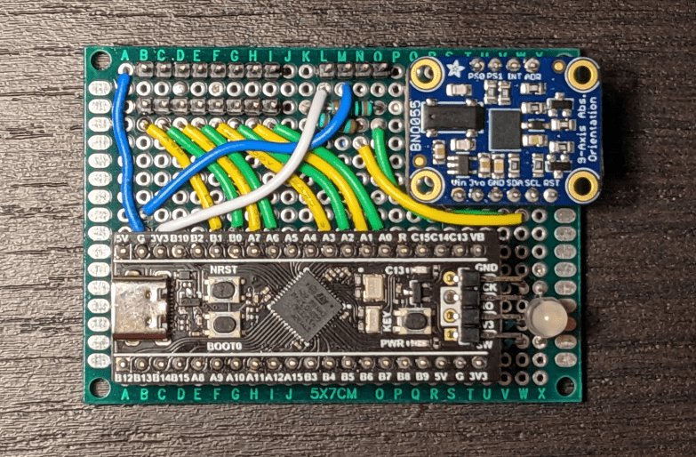
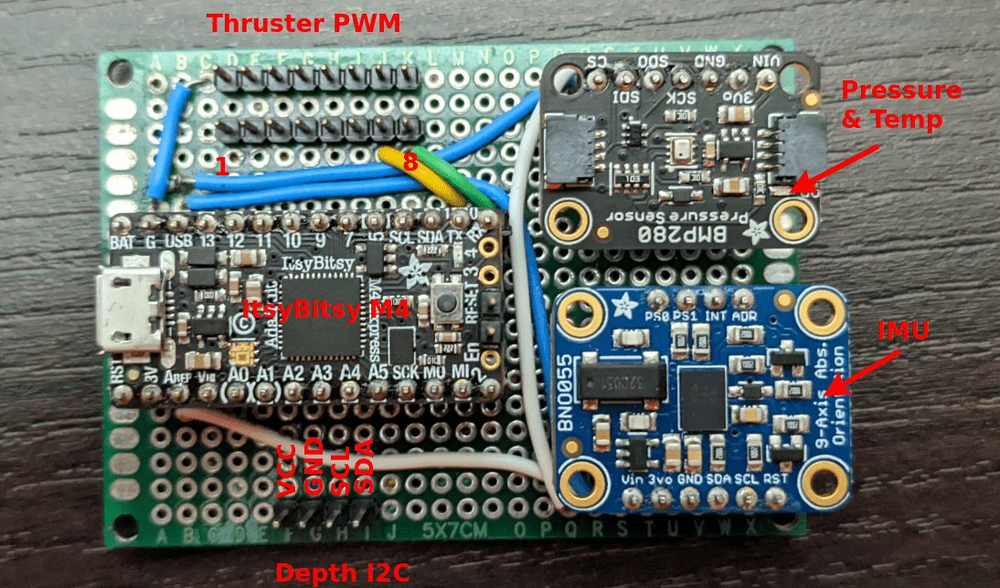
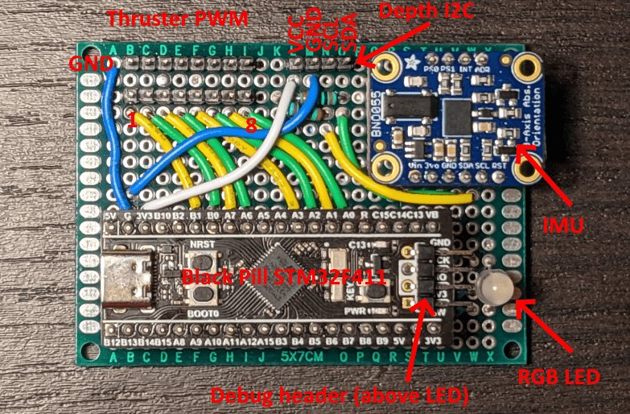

{: .center style="width:80%"}

The control board is responsible for handling robot motion using thrusters. It generates PWM control signals for the robot's ESCs and provides a control interface to the computer via USB.

However, the control board is much more complex than a PWM signal generator with a USB interface. The control board is a motion coprocessor intended to be used by the computer to control the robot's motion.

The control board uses sensors (integrated IMU and external depth sensor) to control the robot's motion in a variety of high-level (abstracted) forms. This allows the computer / mission code to describe a desired motion in a high-level sense and the control board will handle everything required to make it happen.

This is beneficial for a few reasons

- The control board performs the required math and runs the control loops required to maintain robot stability / desired motion. This reduces the required CPU time on the main computer, leaving more processing time for vision and machine learning algorithms.
- The control board is able to generate PWM signals using hardware. Most single board computers would use software to generate PWM signals. This would work poorly for thrusters (due to required pulse widths and number of thrusters). While other solutions to this exists (such as I2C PWM drivers), the other benefits of control board make it a better solution.
- The control board is better able to communicate with sensors and process sensor data, as well as perform time critical tasks (beneficial to control loop stability). This is due to the control board using a microcontroller and firmware based on an RTOS (eliminating the overhead and scheduling uncertainty introduced by a higher level operating system).
- Mission code can use high level descriptions of robot motion. This increases code portability between robots or to a simulator.

The control board is a "third party" project. It was designed by a club member (Marcus Behel) in 2022/2023 with the intent of being used on SeaWolf VIII. It is located on Marcus's [github](https://github.com/MB3hel/AUVControlBoard) and is primarily maintained by Marcus. The code and design are open source.

## Pinout

There are two versions of control board built around two different microcontrollers. The pinout for each is shown below.

### Control Board v1

*Note: The pressure / temp sensor is not included anymore.*

{: .center style="width:80%"}

### Control Board v2

{: .center style="width:80%"}

## Control Board Docs

More information about the control board can be found [here](https://mb3hel.github.io/AUVControlBoard/)
