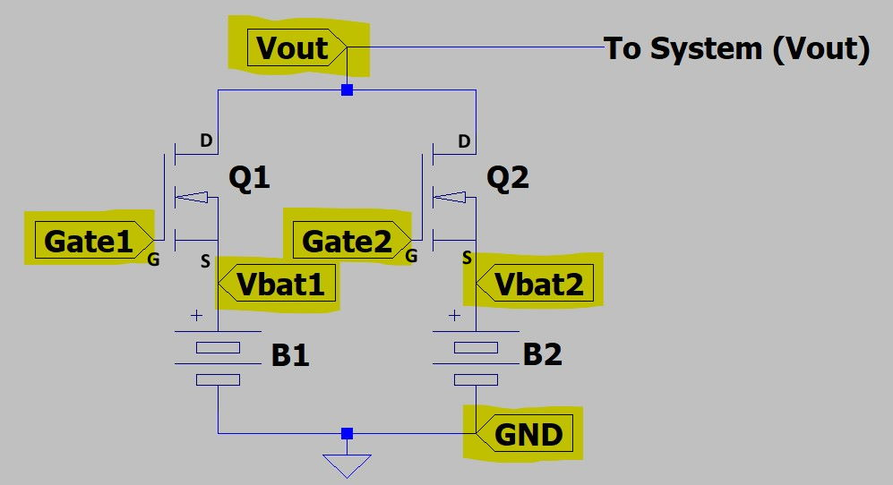

The Load Balancing Board (LBB) is used to safely connect two LiPo batteries in parallel. 

While it is technically ok to connect two identical LiPo batteries in parallel without any additional circuitry, care must be taken to ensure the batteries are charged to the exact same level and perform comparably (typically they should be of the same batch and exact same battery model).

The LBB exists to allow connection of batteries in parallel without having to worry about these issues. The LBB will prevent safety issues with batteries that are not charged to the same level, or issues if one battery is more worn than the other (and thus discharges significantly faster).

## Principle of Operation

The LBB is essentially just a power supply "OR" circuit. Each battery is a "supply" with a voltage ranging from 12.8 (fully discharged) to 16.8 (fully charged). These numbers are approximations for a 4S LiPo battery (14.8V nominal).

Conceptually, power supply ORing can be done using two Schottky diodes (Schottky specifically for the low voltage drops).

The above circuit will "select" the supply with the higher voltage. For now, assume the diodes have no voltage drop (ideal diodes).

- If B1's voltage is higher than B2, then D2 will be reverse biased, thus D2 will be off and Vout will be driven by B1.
- If B2's voltage is higher than B1, then D1 will be reverse biased, thus D1 will be off and Vout will be driven by B2.

Those statements still apply if both diodes have a non-zero forward voltage drop (typically one would use identical diodes so the forward voltage drop is the same). The difference is only that the output voltage (Vout) is less than the battery voltage.

The above circuit is commonly used to connect two power supplies in parallel. Thus if one supply fails or is disconnected, the device continues operating.

 

However there are two issues with using the above circuit for our system

1. Our system is high current (80A total; 40A per battery). It would be difficult to obtain diodes capable of these currents. Additionally, there would be non-negligible power loss through the diodes at these currents.
2. Recall that batteries have some resistance. Thus, as current draw from the battery increase the battery's voltage drops. Assume the active battery's voltage drops below the voltage of the inactive battery. Then the inactive battery becomes active. However it's voltage will then drop, causing a switch back to the active battery. This "oscillation" between batteries will continue indefinitely. Thus, current cannot be evenly distributed across batteries.

The ability to handle issue 2 is often referred to as "droop sharing" where the load between supplies is balanced so they "droop" (or drop) to the same voltage level. **Schottky Diodes do not work well for droop sharing.**

*Note: Droop sharing is not the same as current sharing (equal current split between supplies / batteries). However, assuming the batteries are roughly charged equally and neither is failing, droop sharing will result in roughly equal (or proportional to battery charge) distribution of current. Thus, using 2x 40A batteries is sufficient to power an 80A system. If the batteries are not equally charged, there may be slightly more load on the more charged battery; thus it may reach 40A before the less charged battery (reducing overall current capabilities). This is not an issue for SW8 as the 80A requirement is over-spec'd. However, it is something to be aware of.*

 

For the LBB, a solution is needed that can handle both higher currents and supports droop sharing. This is done using an "Ideal Diode Controller". This is an IC that uses a power MOSFET to mimic the behavior of an ideal diode. Using one of these controllers and a MOSFET, the Schottky diodes can be replaced in the circuit shown above.

The LBB uses Analog Devices's LTC4359 ideal diode controllers applied as shown [here](https://www.analog.com/media/en/technical-documentation/technical-articles/M138-Controller_EN.pdf).

The following circuit replaces the Schottky diodes (for more details on how the circuit works or why it is better than a Schottky diode, see the application note linked above).

In the above image, "Vin" would be connected to the battery (equivalent of diode anode) and "Vout" would be connected to the output (equivalent of diode cathode).

Additionally, as noted by the linked application note, this can be used to connect supplies in parallel for droop sharing. This is what the LBB does.

  
*Image Source: [https://www.analog.com/media/en/technical-documentation/technical-articles/M138-Controller_EN.pdf](https://www.analog.com/media/en/technical-documentation/technical-articles/M138-Controller_EN.pdf) (page 5)*

Note that the diodes in the image above are for reverse polarity protection.

## LBB Component Selection

The MOSFET must be selected with the following considerations

- Must be able to sustain 40A of current while on
- Should have a low on resistance to minimize voltage drop due to the MOSFET
- Thermals should be considered. Packages with builtin heatsink are preferred (this goes along with current capabilities).
- Capable of battery voltage from source to drain
- Capable of battery voltage from drain to source

Selected was the IXTN660N04T4 MOSFET (small 0.85 mOhm on resistance and capable of several hundred amps).

Due to the current required, the LBB is designed to use an off-board MOSFET. The current to / through the MOSFET runs through high guage wires. The LBB itself is a PCB with the MOSFET control circuitry.

## LBB Wiring

The LBB is a PCB housing the ideal diode controllers, reverse polarity protection diodes, and some capacitors to reduce battery noise near the ideal diode controllers. The MOSFETs are external and connected with wires.

The interface header is used to connect the LBB to the MOSFETs and batteries following the diagram below. Highlighted ports are connections to the LBB interface header. 

