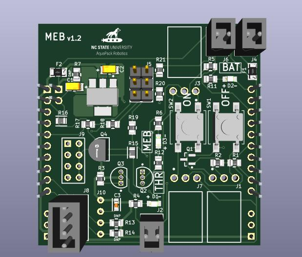
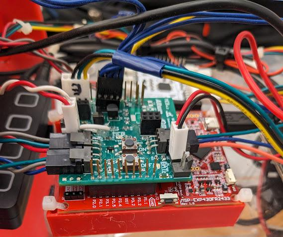
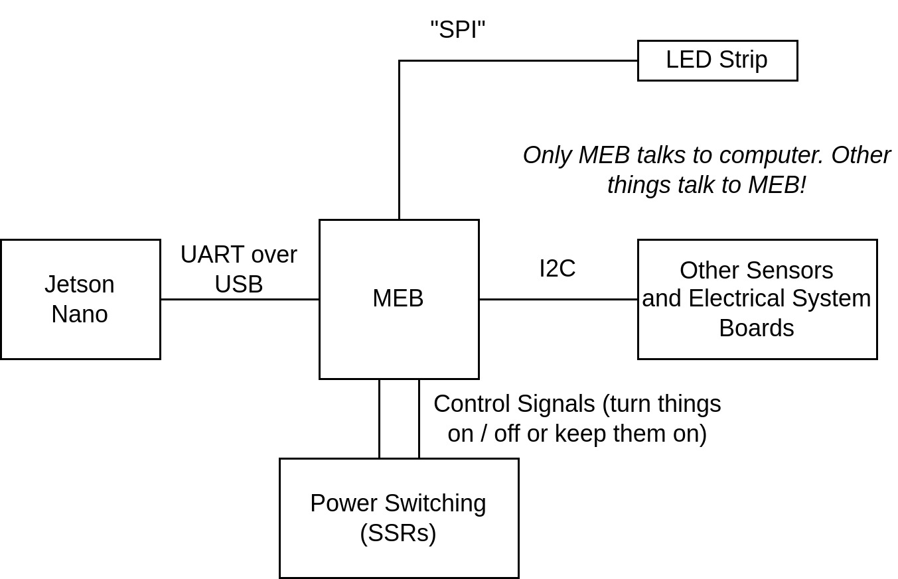
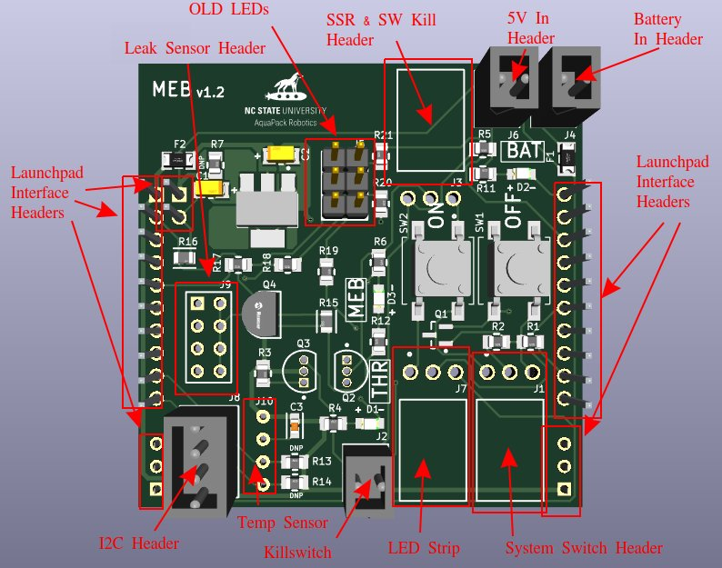
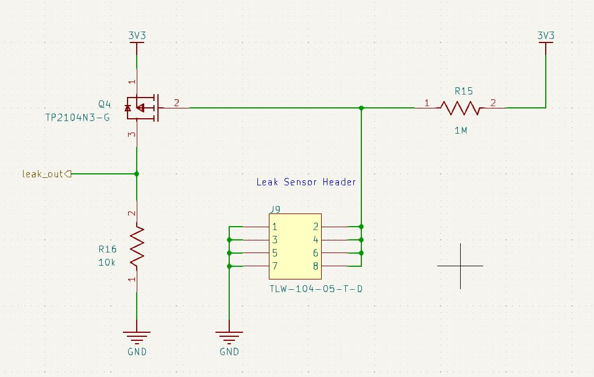

The MEB is the bridge between electrical and software systems. The jetson (running mission software) talks to the MEB via UART. All other electrical system board talk to the MEB via I2C. Communication between the computer and other electrical boards, sensors, etc is facilitated by the MEB.

Additionally, the MEB is responsible for controlling the SSRs to manage system and thruster power.

## Current Design (MEBv1.2)

The MEB is designed to sit on top of an MSP430 launchpad as an expansion board. There is no microcontroller on the MEB itself! MEBv1.2 uses either the MSP430G2553 or MSP430FR2433 launchpads. However, if the firmware (currently Arduino based) were changed, any launchpad should work.

Likewise, the MEB is powered using the 3V3 regulator on the launchpad's ez-FET and the 5V power from MEB via USB.

Additionally, the launcpad includes a debug probe (ez-FET) used to program the board, however this also acts as a USB-UART converter. Thus, MEB communicates with the jetson via this USB port on the launchpad.

 

The MEB, in addition to communicating with the jetson via UART (over USB), has an I2C bus to communicate with all other electrical system boards. This ensures that the computer only needs to communicate with one board (MEB) and can control any part of the electrical system (or obtain data from any part of the electrical system) as needed.

On this I2C bus, the MEB is the Leader (old terminology: "master") and all other boards / sensors are followers (old terminology: "slaves").

The above diagram shows what systems the MEB currently connects to. The diagram below shows the use of each header on the MEB. Note that MEBv1.2 has a few extra headers for things that are no longer used (ex: header for AHT10 temperature sensor, header for old LEDs).

 

The MEB also includes a leak sensor circuit. This circuit is designed to use wire probes to detect leaks in the hull. The MEB is designed to support up to four such probes, which are connected across the leak sensor header.

The MEB's microcontroller is able to detect leaks using this circuit and respond to them (usually by notifiying the user / jetson then cutting system power to minimize potential damage).

 

TODO: Power switching & control (include thruster kill feedback, software kill, ability to shut off system using GPIO, thus no physical switch left in place)

## Future Plans (MEBv2)

TODO: Everything in scope of MEBv2 project
