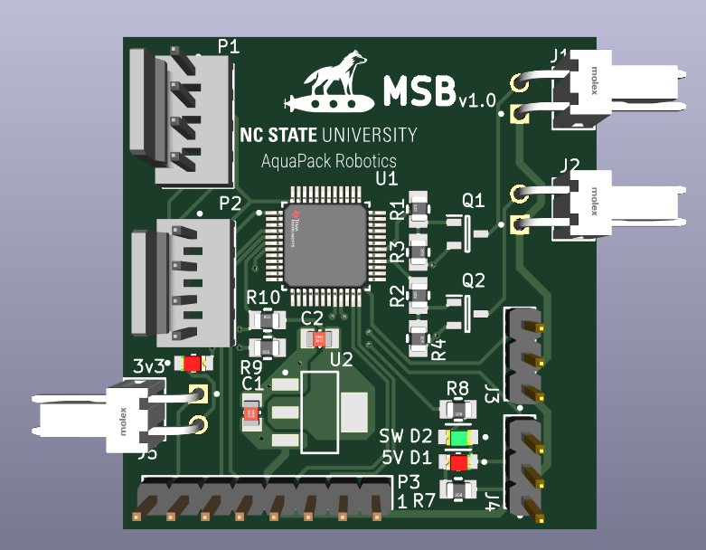
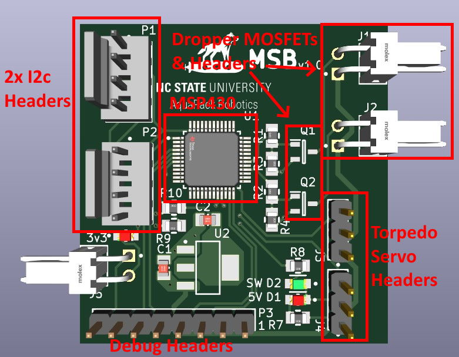
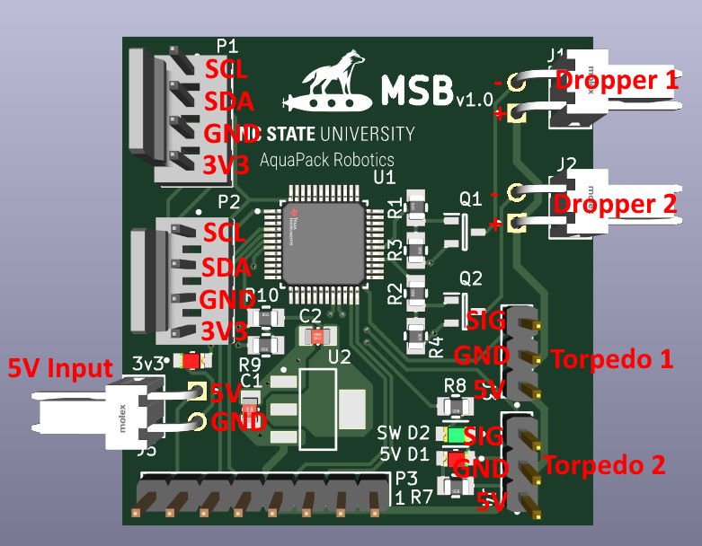

The MSB is used to control mechanical subsystems such as torpedo and dropper. Eventually, a grabber arm may be integrated necessitating another revision of the MSB, however this is not designed as of now.

Torpedo launchers are controlled using servo motors and droppers are controlled using electromagnets. The MSB is designed to control two of each.

The MSB is connected to the MEB's I2C bus, thus all communication to the MSB goes through the MEB.

## Design

The MSB is built around and MSP430FR2355 chip. This chip is used to generate two PWM signals for the torpedo launchers. It also acts as an I2C follower to communicate with the MEB. Note that two I2C headers are included to allow daisy chaining of I2C devices.

The MSB also includes two N-Channel MOSFETs to control power to the dropper's electromagnets.

The power for the MSB comes from an external 5V source (for now, this uses a UBEC). It includes an onboard 3.3V regulator (LDO 5V to 3.3V) to power the MSP430.

Finally, a "Debug" header is included to allow connecting an ez-FET debug probe (from a launchpad board) to the MSB for programming.

## Pinout

## Software

The MSB firmware is written using the MSP430 Arduino core. 

### Software Commands

Each command to MSB is a single byte command (sent in one I2C write from MEB to MSB). The following commands are implemented

| Command Name | Command Byte | Command Description                                                  |
| ------------ | ------------ | -------------------------------------------------------------------- |
| RESET        | 0x00         | Reset all systems (hold marker for droppers and torpedoes not fired) |
| D1_TRIG      | 0x01         | Trigger dropper 1 (release marker)                                   |
| D2_TRIG      | 0x02         | Trigger dropper 2 (release marker)                                   |
| T1_TRIG      | 0x03         | Fire torpedo 1                                                       |
| T2_TRIG      | 0x04         | Fire torpedo 2                                                       |

*Note: Torpedo "fired" and "reset" positions for the servo are defined in the MSB software. These can be changed, however it is usually easier to assemble the torpedo such that the positions are correct. This is done by attaching the arm to the top of the servo in the correct orientation for a known state. For example, use the MSB to "reset" the torpedoes. Then place the arm on the servo so the torpedo is not firing.*

