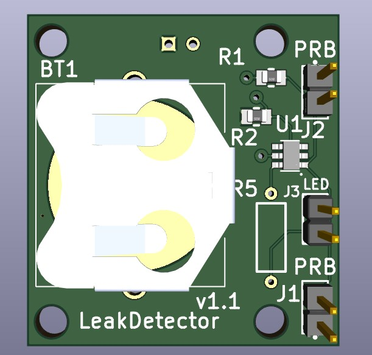
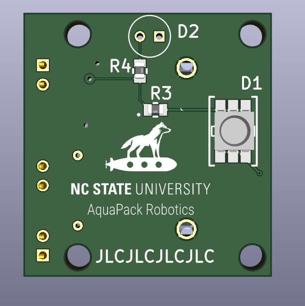

The standalone leak sensor is a coin cell powered board with an LED that turns on when a leak is detected. Leaks are detected using wire lead probes with sponges on the end.

  

## Probes

When assembling the leads, crimp a 2x1 male dupont header. Then insert the header into a piece of sponge. Finally, use hot glue to glue the sponge to the header.

On the other end, crimp a female 2x1 dupont header. The orientation of the probe does not matter. Probes are connected to the "PRB" headers. The lead sensor board supports 2 probes.

TODO: Picture of leads

## LED Indicator

When either of the probes are shorted by water the LED light will turn on. The circuit is designed to turn the LED on for 1 M Ohm of resistance or less (thus it does not need to be a lot of water and is functional with various types of water).

There are three possible LEDs (**Usually you will want to use only one**):

- Builtin Surface Mount LED (D1 on board of board)
- Builtin Through Hole LED (D2 on back of board)
- User Selected LED (LED header on front of board)

Typically, D1 is recommended as it is easy to install the PCB on a clear face of the hull.

D2 is included as an option (usually not populated) for scenarios where the LED needs to be angled differently (installation on a curved face).

For scenarios where the sensor needs to be far from the LED (or the LED needs to be embedded in something else such as epoxy) the LED header can be used to wire an external LED to the leak sensor. When this is done, an appropriate through hole resistor must be installed as R5. For the other LEDs, R5 will not be populated.

D1 and D2 are the following parts

- D1 (Surface Mount): SMTL6-RC
    - Red Color
    - High Brightness (1350mcd)
- D2 (Through Hole): HLMP-EG15-UX000
    - Red Color
    - High Brightness (9300mcd)

The LEDs are red because this is an easily observed color underwater.

## Battery

The leak sensor is designed to run off a CR2023 coin cell battery.

These batteries are typically 220mAh to 235mAh.

Power consumption:
    - MOSFET Leakage current: 15uA (max)
    - D1 On Current: 60mA
    - D2 On Current: 22mA

**If the LED is off**, the battery will last at least 220e-3 Ah / 15e-6 A = 14666.6667 hours = **1.67 years**

**If D1 is on**, the battery will last 220e-3 Ah / 60e-3 A = **3.65 hours**
