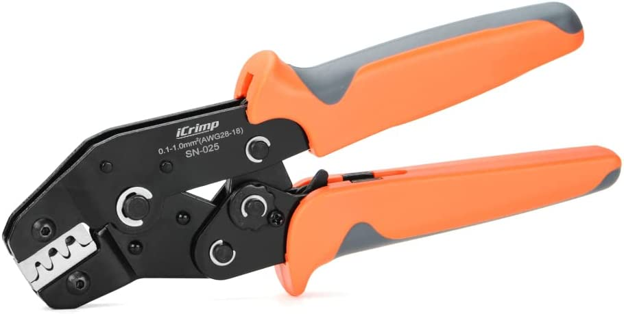
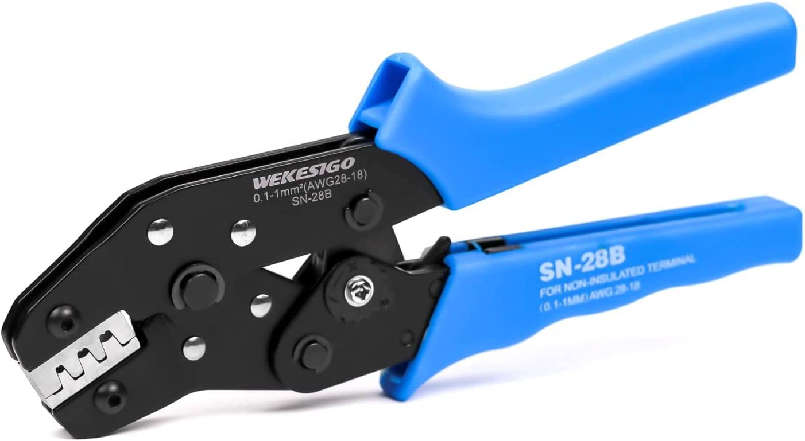
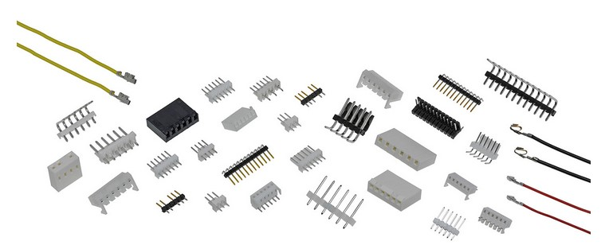
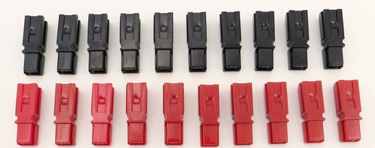

*Note that this page is currently an outline and most of the content is not yet written.*

## DuPont Connectors

{: .center style="width:80%"}

### Tools

**Recommended: IWISS / iCrimp SN-025 Crimper:**

This crimper will crimp both the insulation and the conductor portions at once. Unlike the more common SN-28B crimpers, these will crimp the insulation properly (rounded shape, not an "m" shape).

Note that for smaller wires (28 AWG and smaller) this may not crimp the conductor portion properly. Thus, you may need to use needle nose pliers to press the conductor tabs down further.

{: style="width:40%"}

**Alternate: SN-28B Crimper:**

Similar to the SN-025 crimpers (and much more common), however they do not crimp the insulation portion properly. Thus, you will likely need to use needle nose pliers to "round out" the insulation crimp for the pin to fit in the housing.

{: style="width:40%"}

**Alternate: PA-20 Crimper**

This tool crimps only one portion (conductor or insulation) at a time, however is sometimes easier to use because of that. This tool is an "m" shaped crimp, thus it will not quite crimp the insulation part correctly, however if you do not press down fully on that part it is usually good enough.

{: style="width:40%"}

### Crimping Process

TODO

## Molex KK 254 Connectors

{: .center style="width:80%"}

### Tools

{: style="width:40%"}

### Crimping Process

TODO

## JST SM Connectors

These connectors are keyed wire to wire connectors. Additionally, they latch into place when connected and are resistant to bending of male pins (both when connected and when not connected).

{: .center style="width:80%"}

### Tools

*Note: Information in this section is speculative and not yet verified.*

A crimp tool making an "m" shaped crimp is required. The PA-20 crimper is used for this. It can be used for both the insulation and the conductor crimp portions.

{: style="width:40%"}

### Crimping Process

TODO

## Powerpole Connectors (PP15-45)

{: .center style="width:80%"}

### Tools

The TRIcrimp Powerpole crimp tool should be used. These are reasonably priced and are easily the best Powerpole crimp tool.

{: style="width:40%"}

### Crimping Process

TODO
