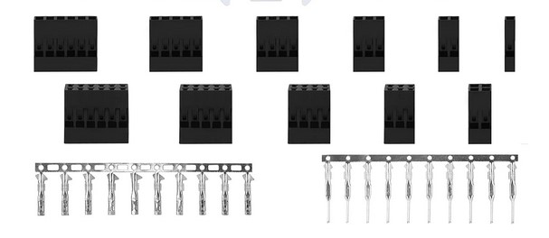

*Note that this page is currently an outline and most of the content is not yet written.*

## DuPont Connectors

"DuPont" connectors (or rather cheap clones of them) are relatively easy to use 2.54mm pin pitch connectors. They are cheap, easily accessible, and not too difficult to crimp (there is a learning curve with how to position the wire though). These connectors can pair with standard pin headers making them a common choice (they also work with breadboards). Additionally, housings of many sizes are commonly found (both 1 row and 2 row housings). However, there are two main downsides. First, they are not keyed. Second, when used for wire to wire connections, the male pins are not protected and are easily bent (both when connected and not connected). Thus, these are best suited for prototyping. Either KK 254 or JST SM connectors are generally recommended for use on the robot instead.

{: .center style="width:80%"}

### Use Cases

- Wire to wire
- Wire to board when paired with standard 2.54mm pin headers
- Intended for signals not power (2A max per pin)

### Tools

**Recommended: IWISS / iCrimp SN-025 Crimper:**

This crimper will crimp both the insulation and the conductor portions at once. Unlike the more common SN-28B crimpers, these will crimp the insulation properly (rounded shape, not an "m" shape).

Note that for smaller wires (28 AWG and smaller) this may not crimp the conductor portion properly. Thus, you may need to use needle nose pliers to press the conductor tabs down further.

{: style="width:40%"}

**Alternate: SN-28B Crimper:**

Similar to the SN-025 crimpers (and much more common), however they do not crimp the insulation portion properly. Thus, you will likely need to use needle nose pliers to "round out" the insulation crimp for the pin to fit in the housing.

{: style="width:40%"}

**Alternate: PA-20 Crimper**

This tool crimps only one portion (conductor or insulation) at a time, however is sometimes easier to use because of that. This tool is an "m" shaped crimp, thus it will not quite crimp the insulation part correctly, however if you do not press down fully on that part it is usually good enough.

{: style="width:40%"}

### Crimping Process

TODO

## Molex KK 254 Connectors

These connectors are 2.54mm pin pitch (so they are easy swapped with DuPonts on boards). It is also possible to connect a dupont wire into a KK 254 header if needed.

Unlike dupont connectors, these connectors are keyed and latch onto the board connectors. Note that non-keyed headers are also sold.

{: .center style="width:80%"}

### Use Cases

- Wire to board
- Intended for signals not power (4A max per pin, possibly less depending on specific crimps and pins)

### Tools

Official crimp tool is very expensive, however there are alternatives. A crimp tool making an "m" shaped crimp is required. The PA-20 crimper is used for this. It can be used for both the insulation and the conductor crimp portions.

{: style="width:40%"}

### Crimping Process

TODO

## JST SM Connectors

These connectors are keyed wire to wire connectors. Additionally, they latch into place when connected and are resistant to bending of male pins (both when connected and when not connected).

{: .center style="width:80%"}

### Use Cases

- Wire to wire
- Intended for signals not power (2A max per pin)

### Tools

*Note: Information in this section is speculative and not yet verified.*

A crimp tool making an "m" shaped crimp is required. The PA-20 crimper is used for this. It can be used for both the insulation and the conductor crimp portions.

{: style="width:40%"}

### Crimping Process

TODO

## Powerpole Connectors

These connectors are high current power connectors. Generally, we use the PP15-45 series. This series' housings fit connectors rated for 15, 30, and 45 amps of current.

These connectors are not cheap, however are easy to crimp, are rated for high currents, are robust and can be keyed (including in a variety of custom configurations).

They work best with wire between 20 and 10 AWG (although smaller wires can work with some effort, this is not recommended).

The same connector is used on both sides of the wire (same housing). Additionally, PCB mount pins are sold.

{: .center style="width:80%"}

### Use Cases

- Wire to wire
- Wire to board
- Intended for power (15A, 30A, and 45A crimps available)

### Tools

The TRIcrimp Powerpole crimp tool should be used. These are reasonably priced and are easily the best Powerpole crimp tool.

{: style="width:40%"}

### Crimping Process

TODO
