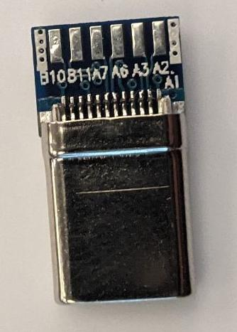

## Intel RealSense HD 

These cameras use a custom enclosure designed to fit an [Intel RealSense Depth Camera (435i)](https://www.intelrealsense.com/depth-camera-d435i/).

{: .center style="height: 80px" }

{: .center style="width: 300px" }

{: .center style="width: 300px" }

### Connection Information

- These cameras will work with only USB 2.0
    - Full operation of the camera (some framerates / resolutions) require USB3
    - Limited to 720p @ 6FPS (yes 6 not 60) and 480p @ 30 FPS when using USB2
    - IMU and depth data may not work with USB 2
- Each camera could require up to 700mA current at 5V depending on the configuration
    - In practice, it is unlikely that this would be used since only the RGB camrea is used
- Note that the depth data does not work underwater (we tried, it does not work)

### USB-C to Dupont Connector

{: .center style="height: 200px" }

This connector is used inside the camera hull to connect the camera (USB-C either 2.0 or 3.0) to the cable penetrated into the hull by dupont connectors.

**These camera enclosures do not make this part of wiring easy. In fact, this is a large part of why these were moved away from.**

These cameras are wired using USB C breakout boards such as [these](https://www.amazon.com/24pin-USB-C-Connector-Housing-5pcs/dp/B01LZEUWGQ). If using USB 3 make sure to get a breakout with 8 pads. If the breakout only has 4 pads, it is USB 2.

{: style="height: 100px" }
{: style="height: 100px" }

Note that the purchased breakouts are **too long to fit in the enclosure**. Thus the PCBs were **sanded** to make them fit (yes the pcb was sanded down using sand paper). They should be sanded right up to (but not touching) the metal pads.

{: style="height: 200px" }
{: style="height: 200px" }

Then, solder wires  onto the pads **backwards**. Soldering backwards ensures the wires will not hang off the edge where the size is constrained.

{: style="height: 100px" }
{: style="height: 100px" }

Then, to prevent shorting on the edge of the camera hull **it is critical to use hot glue to cover exposed conductors**. When doing so, be careful to not get much / any on the edge of the PCB as this would add width to what was just sanded down.

{: style="height: 100px" }
{: style="height: 100px" }

Finally, crimp dupont pins (male) on each wire and assembe in an 4x2 housing as shown below.

{: style="height: 200px" }

| USB C Pin (Breakout Pin) | USB A 3.0 Pin       | Standard Wire Color |
| ------------------------ | ------------------- | ------------------- | 
| GND (A1)                 | GND                 | Black               |
| VBUS (B1)                | VBUS / VCC          | Red                 |
| RX1- (B10)               | TX1- (StdA_SSTX-)   | Purple              |
| RX1+ (B11)               | TX1+ (StdA_SSTX+)   | Orange              |
| D- (A7)                  | D-                  | White               |
| D+ (A6)                  | D+                  | Green               |
| TX1- (A3)                | RX1- (StdA_SSRX-)   | Blue                |
| TX1+ (A2)                | RX1+ (StdA_SSTX+)   | Yellow              |

*Note: On USB-A 3.0 let GND DRAIN float.*

*Notice that USB 3.0 TX and RX are CROSSED! The TX and RX lines should be crossed in the cable. Do this in the dupont connector.*

### Penetrated Wire

A wire should be penetrated (using BlueRobotics penetrator) into the camera hull. This should be an 8-pin wire with shielded pairs for the USB 3 differential pairs (RX and TX Super Speed pairs).

The wire used for this is **TODO: Find specific cable**

The wire is penetrated into the hull and female Dupont connectors installed. These are kept in two groups to allow removal through the penetrator's hole if needed. Note that these should be assembled to connect the wires to the breakout's dupont based on the table shown in the previous section. Note that this pinout is used to cross the TX and RX pairs as required.

{: style="width: 300px"}

This wire is connected to the main hull (by penetrator or fischer) and a USB A wire connected to the other side to go to the computer. Note that a USB 3.0 cable (type A connector) must be used on the inside of the main hull if USB3.0 is used. Otherwise, a USB 2.0 can be used by connecting the power and D+/D- wires (no TX/RX). The colors of the USB A cable will match the colors of the Igus cable (since TX and RX were crossed inside the camera hull's dupont).

### Custom Camera PCB

An attempt was made to design a custom camera PCB to replace the breakouts that must be sanded down. However, these are difficult to assemble (even with reflow process) and the one that we believe to have been assembled properly does not work well (we get a few frames, then the video feed drops). As such, these have been deemed not viable and should not be used.

### Alternatives to Sanding the Breakout

The following were considered:

- Custom camera PCB (do not use)
- 90 degree cables (too large to fit)
- Right angle USB-C ribbon cable (can purchase online; never tested)

## Really Old (SW7/SW6) Cameras

{: style="height:200px" } 
{: style="height:200px" } 

These cameras were used for a short time on SW8, however are not in good condition and do not work well.

These are built using the internals from a Microsoft Lifecam Cinema (originally released in 2009). 

{: style="width:50%" }

### Assembly

The cameras must be disassembled and the two internal boards removed. *Note that the disassembly process is destructive and seems to require cutting metal using flush cuts.* The internal cable uses a connector to one of these boards. It should be cut short and soldered to the fischer receptacle on the back of the camera hull. 

{: style="width:50%" } 

Note that the cameras use 104 fischer receptacles, however when used on SW8 they were connected to a 103 fischer receptacle (both 4 pin). A custom cable was used for this (fischers on both ends; cable diameter must fit both 103 and 104 plugs). Additionally, note that the camera pinout does not match what used to be used for USB 2 pinout on SW8. Thus, the cable "crossed" some signals. *If ever reassembling these cameras, it is recommended to redo the pinout on both ends.*

