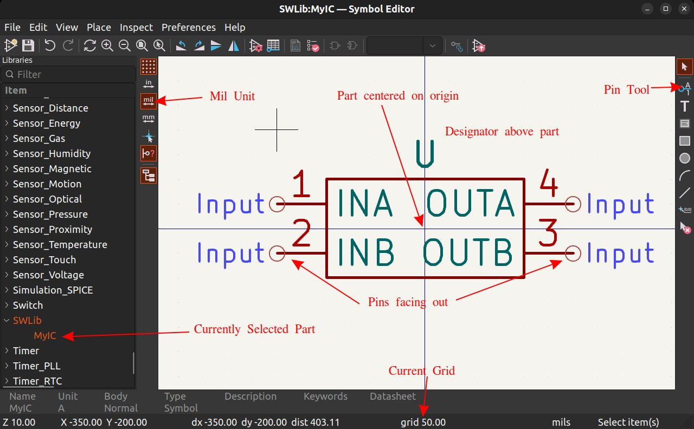

*Note that this page is currently an outline and most of the content is not yet written.*

This user guide is intended to be a reference, not a tutorial. There are many good KiCad tutorials available online, however please note that there are sometimes multiple ways to do things in KiCad (eg library management). *In such cases, please use the methods described on this page.* Part of this page's purpose is to describe our conventions / approaches to using KiCad.

*Note that this guide was written for KiCad 7.0.1*


## Installation

<!--
Note: Download links are intentionally omitted from user guide for a few reasons
    1. It means links only have to be updated in one place
    2. Any required version information or critical notes will be in the overview. This forces people to look there.
-->

See the [Software Overview page](./overview.md#kicad) for download links and required version information (if any).

### Windows

- Download the installer (`exe` file)
- Run the installer. It will require administrative privileges.
- Follow the instructions of the installer. Default settings / options are sufficient.
- Install SWLib (see instructions in following section) after the installation completes.


### macOS

- Download the `dmg` file
- Open the dmg disk image
- Drag the `KiCad` folder to `Applications` as indicated by the arrow
- Wait for the copy operation to complete
- KiCad is now installed
- Install SWLib (see instructions in following section) after the installation completes.


### Linux

- Follow [KiCad's Instructions](https://www.kicad.org/download/linux/). On Ubuntu this entails adding a ppa and installing the packages.
- Install SWLib (see instructions in following section) after the installation completes.


## SWLib

SWLib is a KiCad library containing symbols, footprints, and 3D models for components used on SeaWolf's boards. This library is shared among many robots (not SeaWolf VIII exclusive).

This library must be installed once per system you install KiCad on.

*Note: you must have `git` installed to install, modify, or update SWLib!*


### Installation

1. Clone [this](https://github.com/ncsurobotics/SW-KicadLibrary/) repository somewhere on your system. The location does not matter. *On windows, avoid putting it in OneDrive (ie don't put it in your documents folder)*.
2. Open KiCad. Close any open project (File > Close Project)
3. Preferences > Manage Symbol Libraries
4. The first time you open this menu, you will be asked to "Configure Global Symbol Library Table". Choose "Copy Default Global Symbol Table"
5. On the Global Libraries tab select the folder icon at the bottom (Add existing library to table)
6. Navigate to wherever you cloned the repo. Choose the `SWLib.kicad_sym` file.
7. Click OK to close the symbol library table.
8. Preferences > Manage Footprint Libraries
9. The first time you open this menu, you will be asked to "Configure Global Footprint Library Table". Choose "Copy Default Global Footprint Table"
10. On the Global Libraries tab select the folder icon at the bottom (Add existing library to table)
11. Navigate to wherever you cloned the repo. Choose the `SWLib.pretty` folder.


### Updating

1. Open a terminal or git bash in the folder you cloned the repository to.
2. Run `git pull origin main`


### Creating new Parts

*Before creating a new part, check if it exists in one of the builtin KiCad libraries. Many parts do. You can search in the symbol editor.*

To create a new part, it is necessary to create both a symbol and footprint for the part. Symbols are used in schematics. Footprints are used on the PCB. In their simplest form, both are a collection of pins with unique numbers. On a symbol, pins are "lines". On a footprint, pins are "holes" or "pads" that go in / on the PCB. Pins on a symbol are associated with pins on a footprint by the pin's number. In addition to numbers, pins on a symbol can have human readable names. These are only used to show the designer what the pin is called.

To start, create the symbol

1. Open the symbol editor (in KiCad's main window)
2. Select SWLib in the libraries panel on the left
3. Select the new symbol button (or `File > New Symbol...`)
4. Name the symbol. This should typically match the name of the part you are making a symbol for.
5. Optionally select an existing symbol to derive from ("start with")
6. Change the designator if needed. See [this](https://en.wikipedia.org/wiki/Reference_designator#Designators)
7. Typically, units per package should be left as 1
8. Leave other settings unchanged

    {: style="width: 40%"}

9. Click OK to create you symbol. It will be open in the editor.
10. Make sure the unit is set to "mil" on the left hand toolbar.
11. Make sure the grid is set to 50mil (`View > Grid Properties`). You can see the current grid on the bottom bar.
12. Create the symbol. You can use the tools on the right toolbar to "draw" the symbol (lines, shapes, arcs). **Draw your part centered on the origin!**
13. Then use the "pin" tool (right toolbar) to add the required number of pins. Name the pins using the names in the part's datasheet. Make sure the pin number match the part's package pin numbers. **When creating pins, the "circle" should be facing out.** THis is where wires connect to in the schematic.
14. Make sure to drag the designator above the part
15. Save!

    {: style="width:80%"}

After creating the symbol, determine if you need to create a footprint. KiCad's footprint libraries have a footprint for most standard packages (0603, 0805, 1206, etc for resistors, capacitors, diodes, inductors; QFP, TSSOP, SOIC, DIP, QFN, etc for ICs). Open the footprint editor and search for the package your device uses. If it exists, do **not** create a custom footprint. Skip to step 6. If you do need to create the footprint, follow the instructions below.

1. Open the footprint editor
2. Select "SWLib" in the left panel with all libraries
3. Select `File > New Footprint` to create an empty footprint. Name it the same as your part.
4. Use the footprint editor to place pads and draw any desired silkscreen. Make sure the numbers of the pads match the numbers of the pins the pad should be associated with. Follow numbering convention in the part's datasheet.
5. Save!

    <br />

6. Go back to your part in the **Symbol** editor.
7. Edit symbol properties (`File > Symbol Properties...`)
8.  Click the library icon next to the footprint field (you may need to click the footprint field first).
9. Select the footprint for your part
10. Double check the pin number order of the footprint and schematic. **This is especially important if you are using a footprint you did not make.**
11. Save!

Optionally, you can add a 3D model to a footprint.

1. Create or download a 3D mode. Save it as a step or stl file in `SW-KicadLibrary/SWLib.3d`. Name it the same as the part.
2. Open the footprint editor and select your part.
3. Edit footprint properties (`File > Footprint Properties...`)
4. Select the 3D models tab
5. Click the plus button and type the following. **Never use the browse feature to select a 3d model!** Browse tool uses absolute paths, which will break the model on other people's systems.
    ```
    ../../SWLib.3d/[FILE].step
    ```
6. Replace `[FILE]` with the name of the step file. **This is case sensitive!**.
7. Close the properties panel and save the footprint.

After creating your part (and saving everything) commit your changes in the `SW-KicadLibrary` repo and push.

### Importing Downloaded Parts

Many parts will have footprints and symbols (ECAD models) available for download. These often include 3D models too. Some common sources to find these models are

- SamacSys (easiest to access through mosuer; **DO NOT INSTALL THE LIBRARY LOADER! DO NOT USE IT!**)
- UltraLibrarian
- SnapEDA

Note that you will need an account to use any of these services. 

1. When downloading a model, download symbol and footprint. If a 3D model is available, download it too.
2. After downloading, follow the instructions below depending on where you downloaded the model from. Note that if a 3D model was not available, the 3D model file will be missing.

    ??? custom "SamacSys"
        The downloaded file will be a `.zip` file. Extract it.Locate the following three files.

        - Symbol: `[PART]/KiCad/[PART].kicad_sym` (older parts may only have a `.lib` file. This works too.)
        - Footprint: `[PART]/KiCad/[PACKAGE].kicad_mod`
        - 3D Model: `[PART]/3D/[PART].stp`

    ??? custom "UltraLibrarian"
        The downloaded file will be a `.zip` file. Extract it.Locate the following three files.

        - Symbol: `KiCAD/[NAME]/[NAME].lib`
        - Footprint: `KiCAD/[NAME]/footprints.pretty/[NAME].kicad_mod`
        - 3D Model: `[NAME]/STEP/[NAME].step`

    ??? custom "SnapEDA"
        The downloaded file will be a `.zip` file. Extract it.Locate the following three files.

        - Symbol: `[PART].kicad_sym`
        - Footprint: `[PART].kicad_mod`
        - 3D Model: `[PART].step`

3. Open KiCad's symbol editor
4. Find SWLib in the panel on the left.
5. Right click "SWLib" and choose "Import Symbol..."
6. Choose the symbol file (`.lib`) described above.
7. Save the symbol.
8. Open the footprint editor.
9. Find SWLib in the panel on the left.
10. Right click "SWLib" and choose "Import Footprint..."
11. Choose the footprint file (`.kicad_mod`) described above.
12. Save into SWLib
13. Copy the 3D model file (`.step` / `.stp` file described above) to SWLib. This must be copied to wherever you cloned SWLib. Paste the `.step` file into `SW-KicadLibrary/SWLib.3d`
14. In the footprint editor, edit footprint properties (`File > Footprint Properties...`)
15. Select the 3D models tab
16. Click the plus button and type the following. **Never use the browse feature to select a 3d model!** Browse tool uses absolute paths, which will break the model on other people's systems.
    ```
    ../../SWLib.3d/[FILE].step
    ```
17. Replace `[FILE]` with the name of the step file. **This is case sensitive!**. Change `step` to a different suffix if the file uses a different suffix.
18. Close the properties panel and save the footprint.
19. Go back to the symbol editor and select the imported symbol.
20. Open symbol properties (`File > Symbol Properties...`)
21. Click the footprint field, then select the browse button
22. Choose the footprint now imported into the SWLib footprint library
23. Close the symbol properties panel and save.

After importing your part (and saving everything) commit your changes in the `SW-KicadLibrary` repo and push.

## Creating a New Project

*Make sure you have installed SWLib first!*

TODO


## Opening an Existing Project

*Make sure you have installed SWLib first!*

TODO


## Design Workflow

### Schematic

**Always use a 50mil grid in the schematic editor!** If absolutely necessary, a 25mil grid can be used occasionally, but try to avoid doing so.

TODO


### Electrical Rules Check

TODO


### Assign footprints

TODO


### PCB Setup

It is generally necessary to setup some board stackup parameters (specificaly the number of copper layers) before starting the PCB. In order to make running DRCs later, it is best to import board settings from one of the [SW-KiCad-Templates](https://github.com/ncsurobotics/SW-KiCad-Templates/tree/main). These templates are based on PCB manufacturer board stackups and include design rules. Specifics (such as board color, default item sizes, etc) can be customized after importing a template. To import a template, follow the steps listed below

1. Download a zip of the repo and extract the zip (or just clone it)
2. Open your project in KiCad
3. Open your PCB
4. Open Board Setup (`File > Board Setup`)
5. Click the button on the bottom left labeled "Import Settings from Another Board"
6. Choose the `kicad_pcb` file for the template you want to use. Which template is used should depend on how you plan to design the PCB (number of layers, impedance control, etc) as well as who you plan to have manufacture the PCB.
7. After selecting a template file, click the "Select All" button (rarely will you want to import only some settings)
8. Click "Import Settings"
9. Click "OK" to close the board setup dialog
10. Save the PCB file


### PCB Layout & Routing

**Always work in mil not mm grid!**

TODO


### Design Rules Check (DRC)

TODO


## Tips and Tricks

TODO

<!--
- "Flat" multi page schematic
- Note on using "HandSolder" footprints
- Bulk footprint assignments
-->