There are various tools and pieces of software used in relation to the electrical design of SeaWolf VIII. These are listed below

## PCB Design

### KiCad

**Required Operating System:** Windows, macOS, Linux

**Download Links:** [KiCad](https://www.kicad.org/)

Used to design PCBs and schematics for various custom boards in use on SeaWolf VIII. KiCad is a free and open source Electronic Design Automation (EDA) tool which is generally easy to learn to use, but powerful enough when needed.

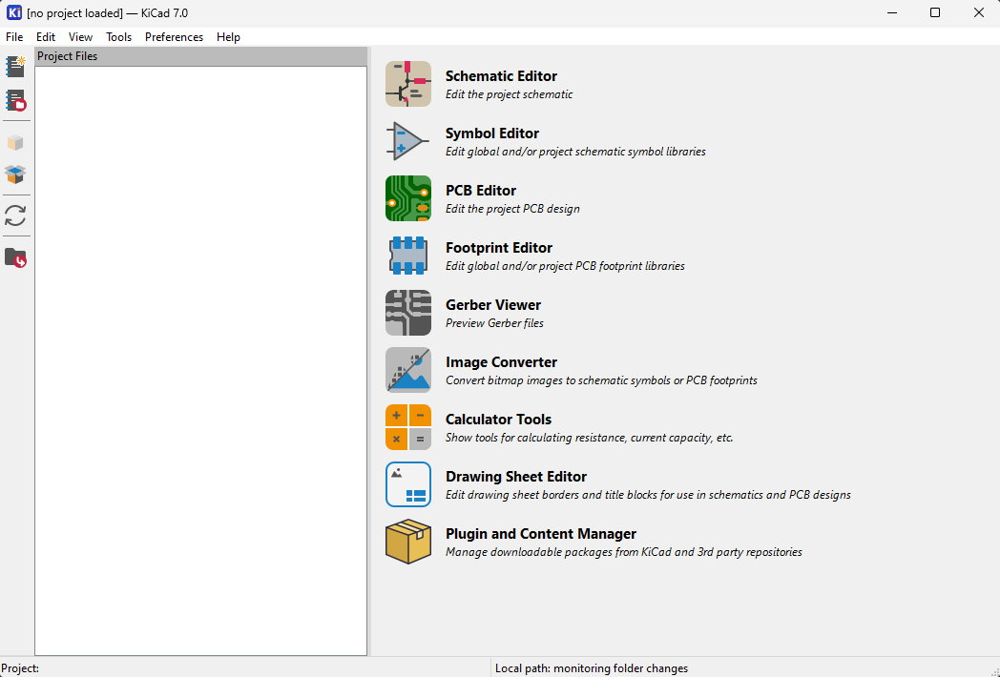{: .center style="width: 80%"}

### Altium Designer

**Required Operating System:** Windows

**Download Links:** [Altium Designer](https://www.altium.com/altium-designer) (license either through university or AquaPack)

Many SeaWolf VIII boards were originally designed using Altium Designer. Altium Designer is a proprietary EDA tool. While more commonly used in industry than KiCad, the decision was ultimately made to move to KiCad to simplify library management, reduce software learning curves, and improve operating system compatibility.

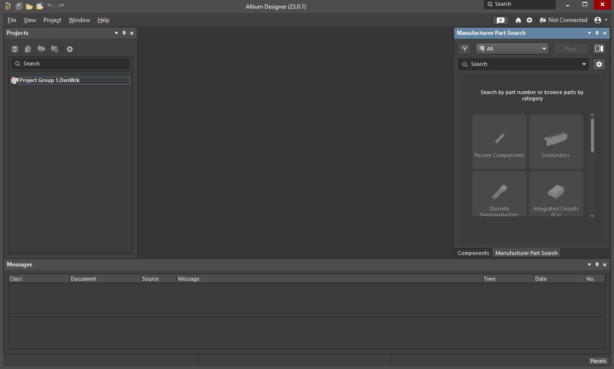{: .center style="width: 80%"}

## MSP430 Embedded Firmware

Custom PCBs used on SeaWolf VIII are designed around TI's MSP430 MCUs or Launchpad development boards. The firmware for these boards is developed using one of the following tools. *Note that IAR is intentionally avoided.* TI's CCS is free and fully featured with no code size limit. Additionally, IAR's evaluation license only allows access to the newest version of IAR which can make project compatibility and maintenance difficult.

### Arduino / Energia

**Required Operating System:** Windows, macOS, Linux

**Download Links:** [Arduino IDE](https://www.arduino.cc/en/software) | [MSP430 Core](https://github.com/MB3hel/Arduino-Core-MSP430)

While the Energia project is officially unmaintained since November 2022, there are builds of the Energia MSP430 Arduino core located at the link above. These builds user newer tooling and fix bugs with some of the chips used. This core can be installed with the official Arduino IDE.

Generally, this is used only during prototyping or when rapid firmware development is required.

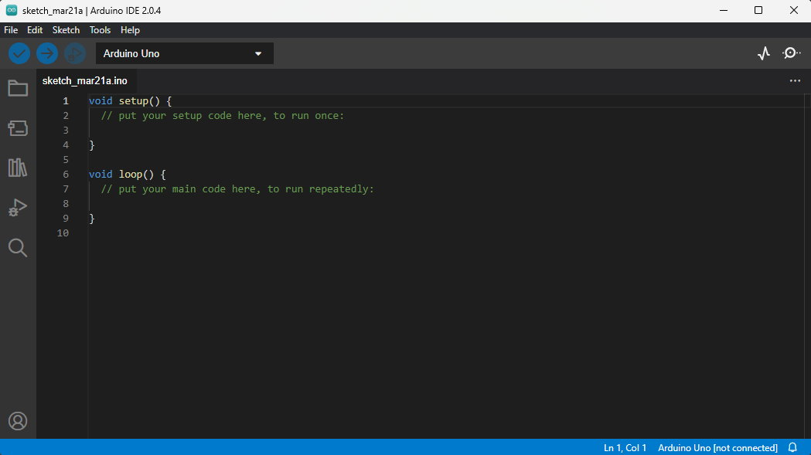{: .center style="width: 80%"}

### TI Code Composer Studio (CCS)

**Required Operating System:** Windows, macOS, Linux

**Download Link:** [TI CCS](https://www.ti.com/design-resources/embedded-development/ccs-development-tools.html) | [MSP430 GCC](https://www.ti.com/tool/MSP430-GCC-OPENSOURCE)

TI's Code Composer Studiohttps://www.ti.com/design-resources/embedded-development/ccs-development-tools.html supports the MSP430 chips using TI's compiler or a separately installed open source GCC compiler. This IDE is Eclipse based and integrates a debugger among many other tools.

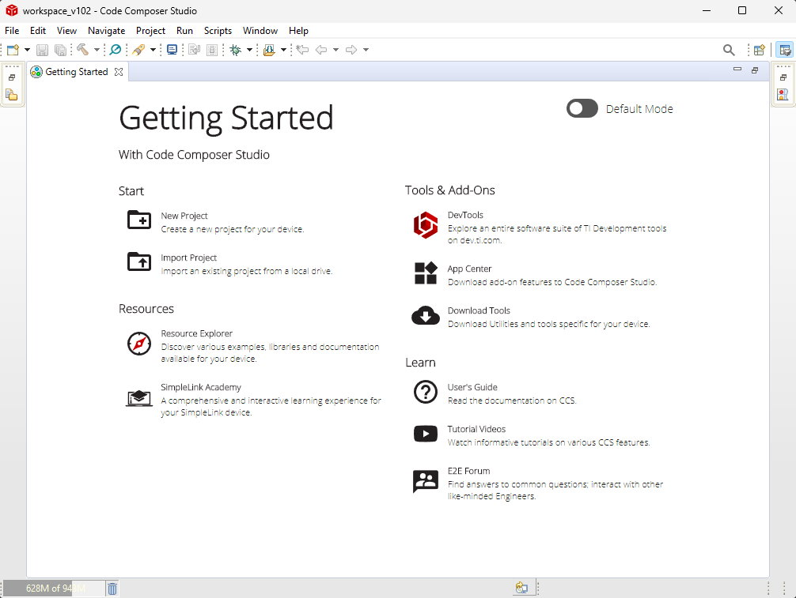{: .center style="width: 80%"}

## Circuit Simulation

### LTSpice

**Required Operating System:** Windows, macOS, Linux (through Wine)

**Download Link:** [LTSpice](https://www.analog.com/en/design-center/design-tools-and-calculators/ltspice-simulator.html)

LTSpice is a free circuit simulator with builtin models for many Analog Devies / Linear Tech chips. This is generally our preferred circuit simulator as it is easy to install and use. In some cases however, models designed for PSpice (usually TI parts) are not compatible (they are either encrypted or use PSpice features that LTSpice does not have). In these cases other software is used.

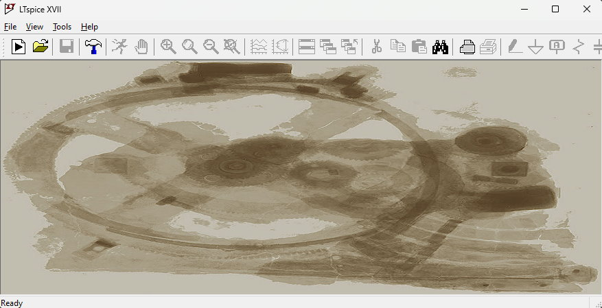{: .center style="width: 80%"}

### PSpice for TI

**Required Operating System:** Windows

**Download Link:** [PSpice for TI](https://www.ti.com/tool/PSPICE-FOR-TI)  
*(requires TI account and export approval)*

PSpice for TI is a limited feature version of Cadance's PSpice simulator. It is more difficult to setup, thus we generally prefer LTSpice, however there are cases where this should be used instead (when a TI model is encrypted or when a model uses PSpice features that LTSpice does not support). Note that using ADI / LT devices is often not possible in PSpice. ADI / LT typically provide encrypted LTSpice models only.

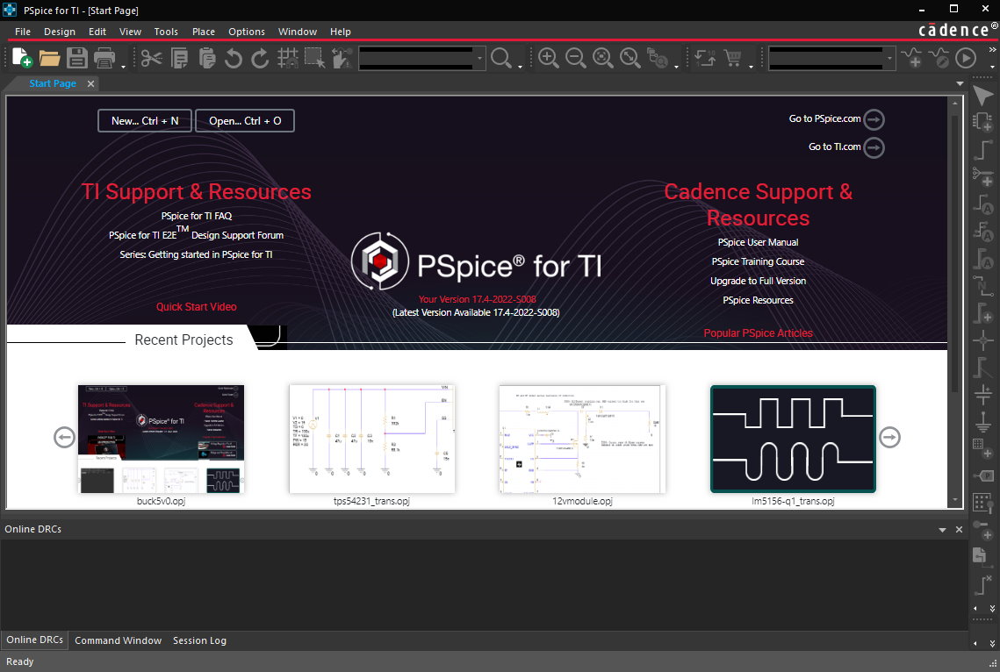{: .center style="width: 80%"}

## Hardware Design (FPGA)

### ModelSim

**Required Operating System:** Windows, Linux

Historically, we have used ModelSim for Verilog design simulation, however due to recent licensing changes we are migrating to OEM tools. In the case of some FPGAs (eg Intel) this would mean Intel Questa tools (which replace Intel ModelSim), however for other vendors we intend to use their tooling.

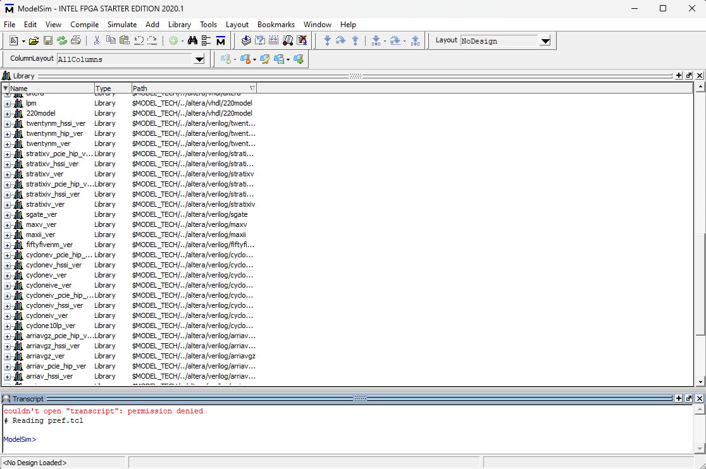{: .center style="width: 80%"}

### Vivado & Vitis

**Required Operating System:** Windows, Linux

**Download Link:** [Vivado ML Edition](https://www.xilinx.com/support/download.html)  
*(requires AMD account and export approval)*

Vivado is used with our Digilent Basys3 FPGA dev board used for the Acoustics system. Vivado is currently used for synthesis, implementation, and bitstreaming. Going forward we intend to explore Vivado's simulation functions too.

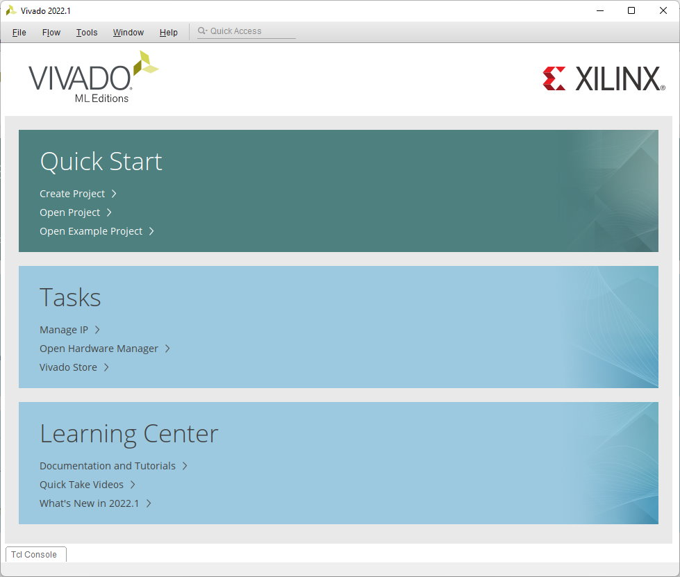{: .center style="width: 80%"}

## Scientific Computing

*Generally used for mathematic modeling, validation, or simulation.*

### MATLAB

**Required Operating System:** Windows, macOS, Linux

**Download Link:** Accessed through university. Follow university instructions.

If MATLAB is available, it is generally advisable to use it over GNU Octave as MATLAB is faster and better supported.

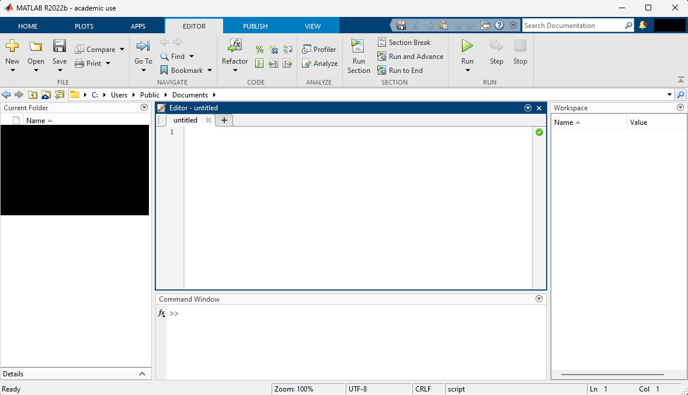{: .center style="width: 80%"}

### GNU Octave

**Required Operating System:** Windows, macOS, Linux

**Download Link:** [GNU Octave](https://octave.org/download)

If MATLAB is not available, GNU Octave is compatible with many MATLAB programs. GNU Octave is free and open source with many packages similar to MATLAB toolboxes as well. While generally compatible with MATLAB code, Octave does not implement all functions. In particular many more recent MATLAB "helper" functions (ie advanced string manipulation functions) are not implemented and require more complex sets of operations to replicate in Octave. However, most core math functions are implemented in Octave.

Due to the few compatibility issues Octave may have, and the fact that Octave is likely slower than MATLAB, it is usually recommended to use MATLAB if a license is available.

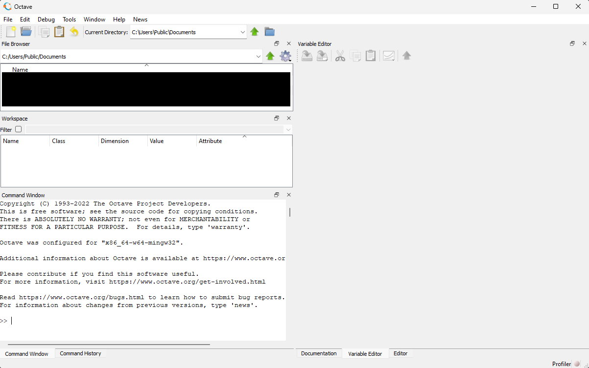{: .center style="width: 80%"}

### Python + 3rd Party Packages

**Required Operating System:** Windows, macOS, Linux

**Download Links:** [Python 3](https://www.python.org/downloads/) | [NumPy](https://numpy.org/install/) | [SciPy](https://scipy.org/install/) | [Matplotlib](https://matplotlib.org/stable/users/getting_started/)  
*(On Linux use distribution package manager to install python3)*

Instead of MATLAB it is sometimes preferred (personal preference, language experience, better tool for the particular job, etc) to use Python with a few third party libraries. These libraries are usually `numpy`, `scipy`, and `matplotlib` (install these packages with `pip`). These libraries can allow python to be a very useful scientific computing tool for many similar applications to how MATLAB or Octave may be used.

## Other

### Git SCM

**Required Operating System:** Windows, macOS, Linux

**Download Link:** [Git SCM](https://git-scm.com/downloads)  
*(On macOS install Xcode command line tools; On linux install using distribution package manager)*

Most of our PCB design files and embedded firmware source code is located in GitHub which uses git as a source control / version control tool. You will need `git` installed on your computer to use these repositories.

### Digilent WaveForms

**Required Operating System:** Windows, macOS, Linux

**Download Link:** [WaveForms](https://digilent.com/shop/software/digilent-waveforms/) | [Adept Runtime](https://digilent.com/reference/software/adept/start)  
*(On Linux make sure to install the Adept runtime first. This is not required on Windows or macOS)*

Many members of the club have an Analog Discover 2 from coursework. WaveForms allows this to be used as an oscilliscope, logic analyzer, waveform generator, spectrum analyzer, and many more tools.

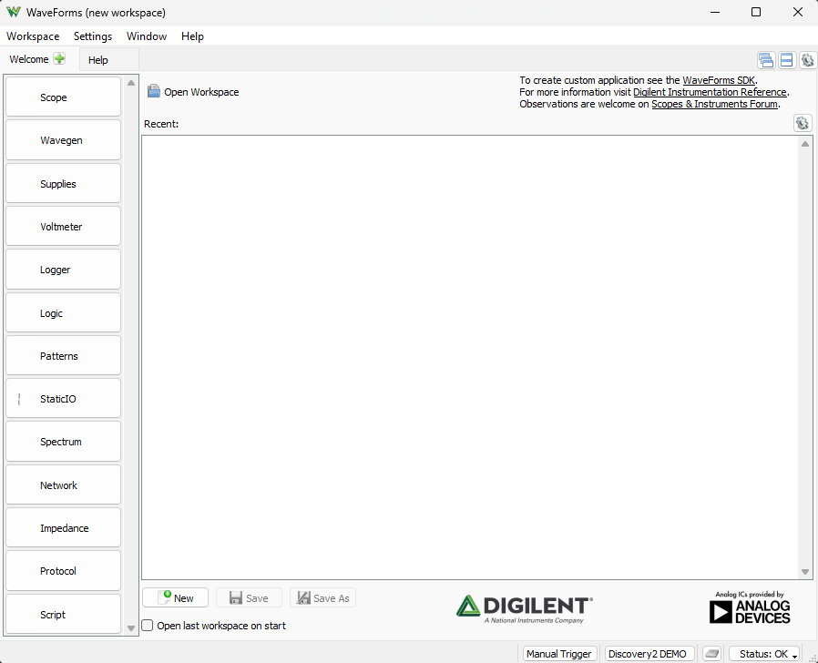{: .center style="width: 80%"}
