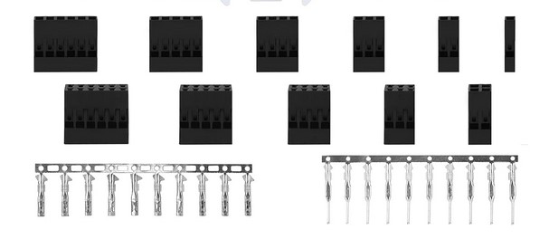
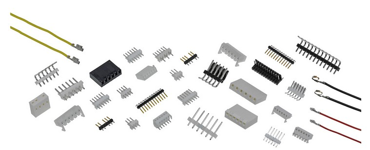
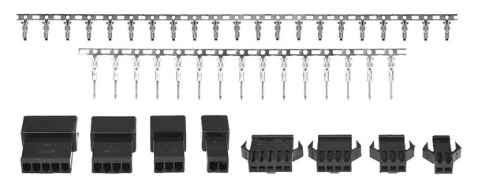
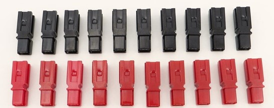
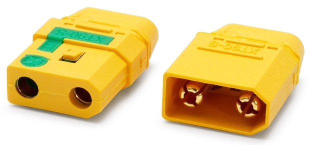
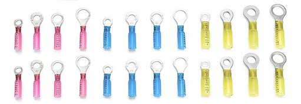

*Note that this page is currently an outline and most of the content is not yet written.*

## Connectors

**Signal & Low Current**:

- Wire to Wire: JST SM
- Wire to Board: Molex KK 254
- Fallback (either): DuPont (use only when JST-SM or Molex KK 254 are not viable, recommended only for prototyping)

**Higher Current**

- Wire to Wire or Wire to Board: Powerpole (PP15-45 series)
- Wire to Wire: XT90 (use these only for connections directly to battery or where current larger than 45A is required)
- Wire to Screw Terminal: Heat shrink ring connectors

### DuPont Connectors

{: .center style="width:80%"}

- Wire to wire
- Wire to board when paired with standard 2.54mm pin headers
- Intended for signals not power (2A max per pin)
- Cheap and easy to get (kits easily found on Amazon)
- Moderately difficult to crimp
- Not keyed
- Male pins are easy to bend / break both when connected and when not connected
- Pair well with standard 2.54mm pin headers
- Work with breadboards
- Housings in two-row configurations are sold

### Molex KK 254 Connectors

{: .center style="width:80%"}

- Wire to board
- Intended for signals (4A max per pin, less depending on crimp pin selection)
- More expensive than DuPont connectors (but better)
- No kits sold, must buy individually from digikey / mouser
- Moderately difficult to crimp
- Keyed
- Male pins always on board. Only female crimps for wire.
- 2.54mm pin pitch, so compatible with DuPont connectors and standard pin headers if necessary
- Housings only in one-row configurations

### JST SM Connectors

{: .center style="width:80%"}

- Wire to Wire
- Intended for signals (2A max per pin)
- Can find in kits on Amazon (harder to find than DuPont, but possible)
- Moderately difficult to crimp
- Keyed
- Latching
- Protected male pins (both when connected and not connected)
- Housings only in one-row configurations

### Anderson Power Powerpole Connectors (PP15-45 series)

{: .center style="width:80%"}

- Wire to Wire or Wire to Board
- Intended for power (15, 30, 45 A)
- Expensive
- Easy to crimp
- Keyed
- Same housing / pin used on both sides of connection
- Custom configurations possible (custom size and key of connector block)
- Recommended for wire from 20 to 10 AWG

### XT90 Connectors

*Note that XT60 connectors are rarely used, but are generally the same idea (just lower current rating). XT60 connectors are only used on the battery chargers and should not be used on the robot itself.*

{: .center style="width:80%"}

- Wire to Wire
- Wire to Board *may* be possible, but not recommended.
- Soldered **not crimped**
- Somewhat difficult to solder (generally requires heatsink and large iron tip)
- Robust connectors
- Work well with larger gauge wire only (14-10 AWG)

### Heat Shrink Ring Connectors

*Note: There are variants of these sold that are "U" shaped (not a closed ring). These are not to be used on the robot as they easily come loose.*

{: .center style="width:80%"}

- Wire to screw terminal
- Can be used wire to wire with a loose screw & nut, but **not** recommended.
- Easy to crimp
- Generally can handle the same current as any wire that can fit inside them

## PCB Headers

- Standard 2.54mm headers (right angle and vertical)
- KK 254 headers (right angle and vertical)
- Powerpole headers (right angle and vertical)

## Electronic Assembly

- PCBs
- Protoboard
- Breadboard (avoid on robot, if necessary hot glue EVERYTHING)
