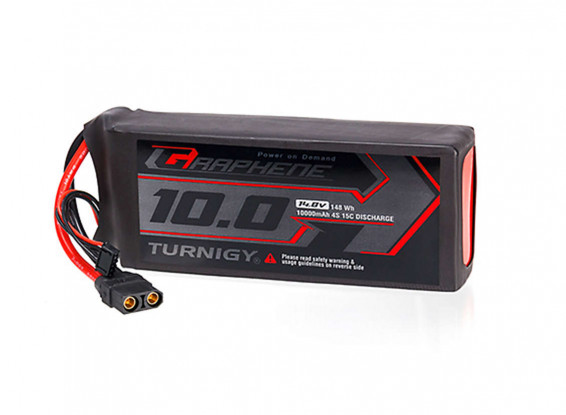
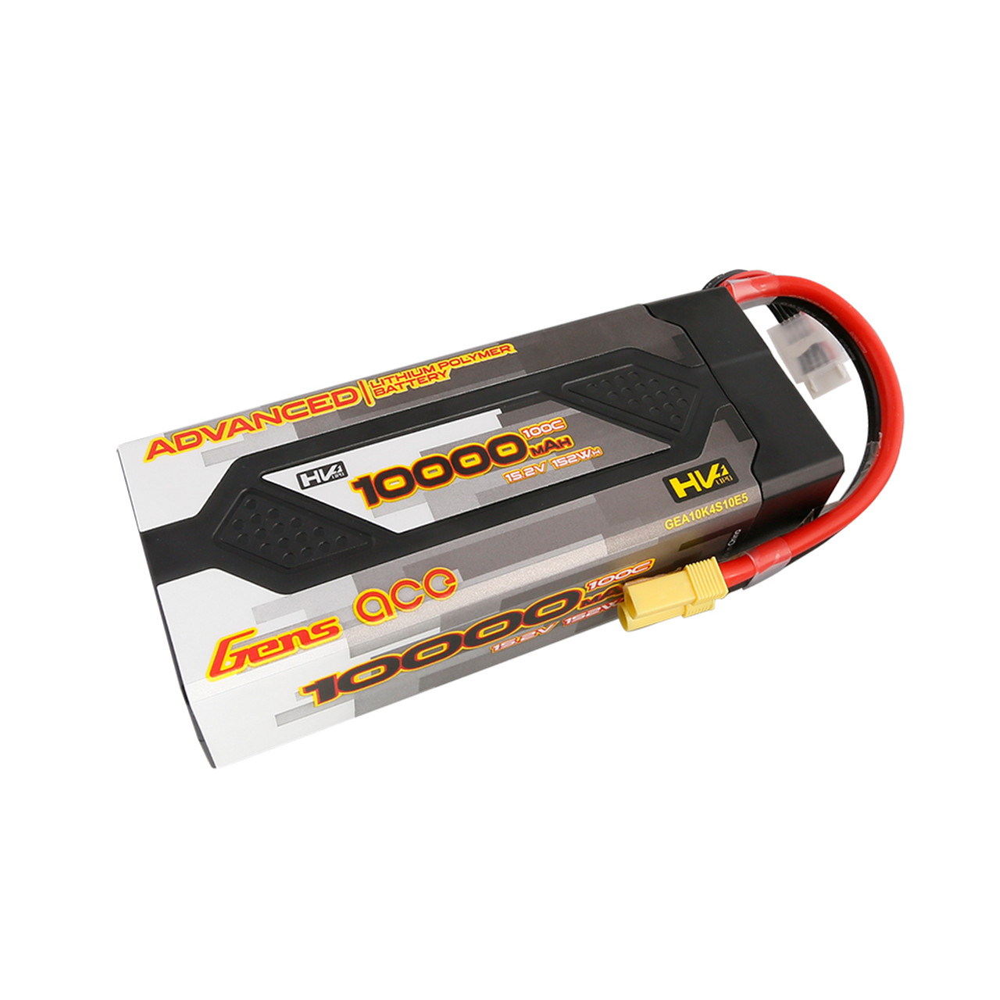

## Power Requirements

SeaWolf VIII's most power consuming components are the thrusters. It uses 8 BlueRobotics T200 thrusters. The following information was sourced from BlueRobotic's site for the T200 thrusters

| Nominal Voltage | Full Throttle Current |
| --------------- | --------------------- |
| 10V             | 14A                   |
| 12V             | 17A                   |
| 14V             | 21A                   |
| 16V             | 24A                   |
| 20V             | 32A                   |

It is not realistic that all 8 thrusters will be running full throttle at all times. Thus, these current numbers determine how individual thrusters should be fused, not total system power requirements. 

Note that one thruster's motion will also result in some amount of battery voltage drop, thus a second thruster will have a lower "nominal" voltage, and so on for all 8 thrusters. This imposes a limit on max system current draw.

For physical size and current draw reasons, it was decided to use 4S LiPo batteries (nominal 14.8V).

Based on charts provided by BlueRobotics, it was predicted that SW8's max current draw would be between 40 and 60A. This was later experimentally determined to be an over estimate (all thrusters at full power was measured to be approx 38A steady state).

Battery selection was based on the 60A number. This motivated the 2 battery architecture along with a desire for longer run times. Physical size constrained us to 10000mAh batteries. We speculated that a 30A steady-state current draw would be possible while in motion at competition speeds. Thus 10Ah / 30A = 20minutes of runtime per battery. With 2 batteries this would allow 40 minutes of runtime.

**Please not that the 30A was an over estimate. In practice we seem  to get about 2 hours of runtime off SW8 while holding depth and moving at translational speeds of 30%, which is a reasonable speed for competition runs.**

## Old Batteries

Originally, SW8 used [Turnigy Graphene 4S 10000mAH LiPo Battery Packs](https://hobbyking.com/en_us/turnigy-graphene-professional-10000mah-4s-15c-lipo-pack-w-xt90.html). These batteries work well enough, however there are several concerns / potential issues

1. "Cheap" LiPo makers (such as Turnigy) often use reject cells. These are usually not safety concerns, but will result in significantly poorer performance than advertised.
2. Cheap LiPos often over spec their batteries (discharge and charge rate specs).
3. The cells used in cheaper batteries often change over time in the same product. Thus, it is usually difficult or impossible to get a proper MSDS for the batteries without opening one of the same age up. This is a potentially hazardous process and renders the battery useless.
4. Manuals and information is often hard to find
5. Usually, these are soft shell LiPo batteries. This is less desirable for our use case as it would provide less protection from moisture in the event of a leak than a hard shell LiPo case.

For these reasons, as well as the age of the batteries, it was decided to transition to a new set of batteries without these issues. The old Turnigy batteries are still kept as a backup set of batteries as they show no signs of concerning wear.

## New Batteries

The newer batteries were chose to avoid issues with the previous ones. The selection criteria were as follows

1. Manufacturer must provide a MSDS or exact cell model number
2. Manufacturer must provide all manuals downloadable before battery purchase
3. Manufacturer manuals must include specs, handling and safety information, as well as disposal information.
4. Ideally, hard shell LiPo battery

The selected batteries currently in use are [Gens ace Advanced 10000mAh HardCase Lipo Battery Packs](https://genstattu.com/gens-ace-advanced-10000mah-15-2v-100c-4s2p-hardcase-lipo-battery-pack-61-with-ec5-plug/).

Gens ace provides all required information on the batteries, and are generally regarded as being one of the better LiPo manufacturers in hobby communities (generally, they don't over spec batteries and seem to not use reject cells). The batteries in question are still 4S 10000mAh batteries and physically fit in the same battery hulls as the old batteries used. They are also hard shell LiPos with some additional safety features builtin (over discharge warning, imbalance warning, etc).

