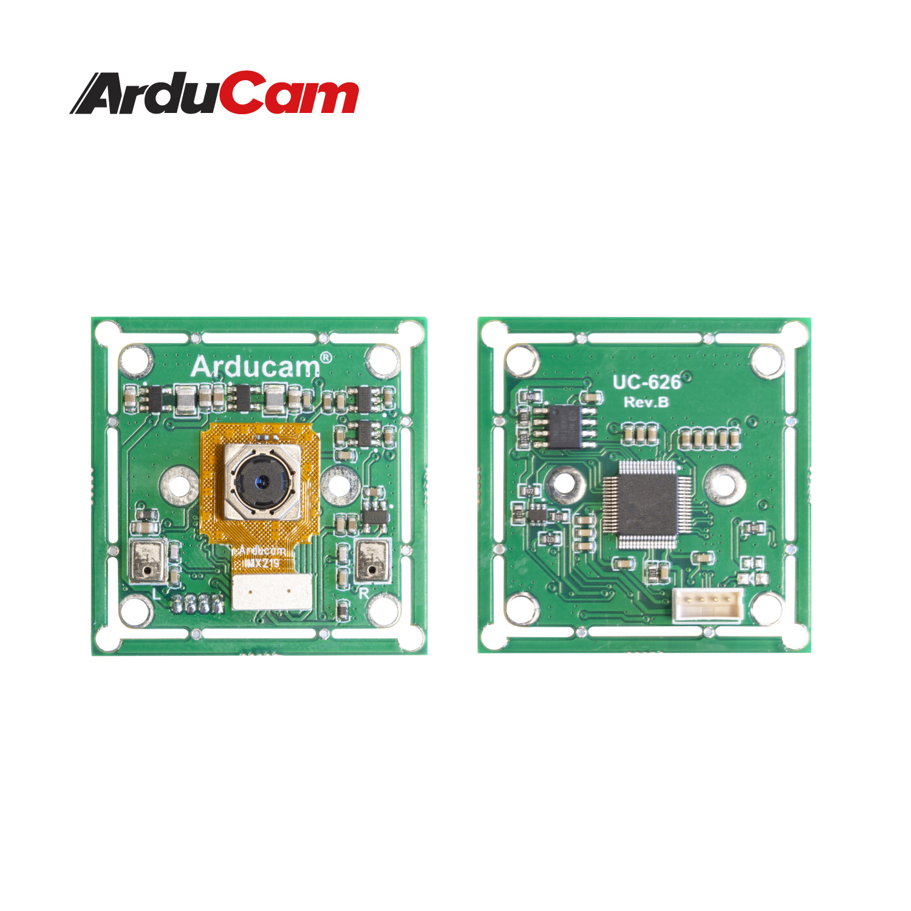
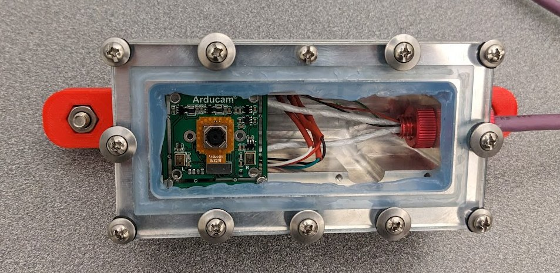
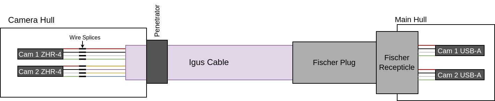
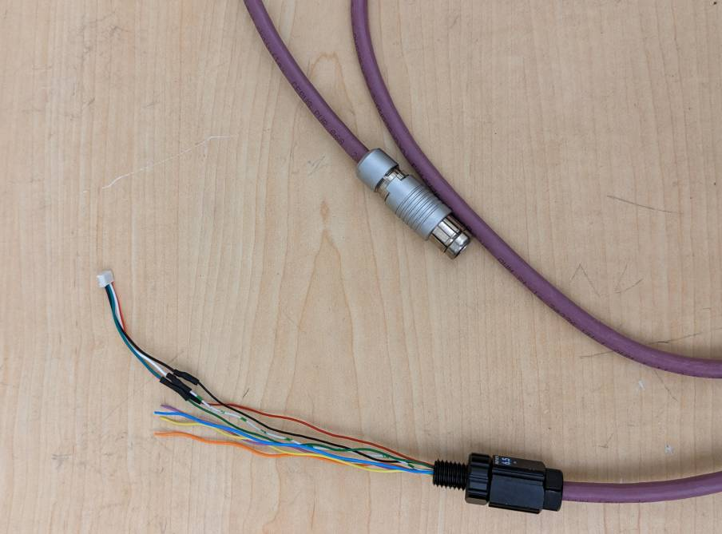
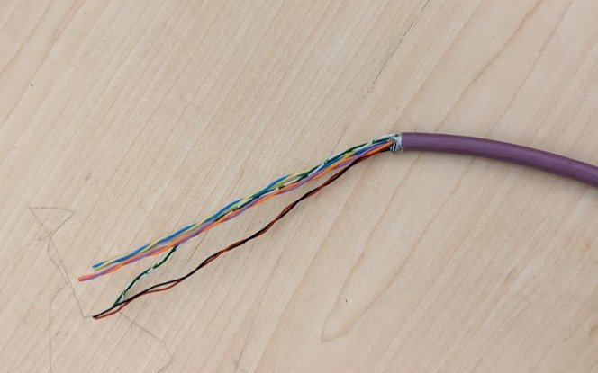
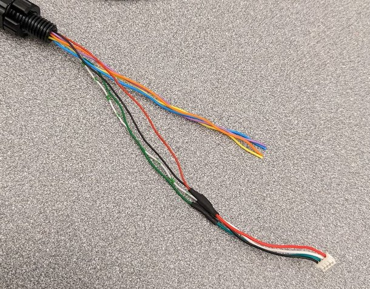

*Note that this page is currently an outline and most of the content is not yet written.*

The current Cameras used on SeaWolf VIII are based on [ArduCam B0292](https://www.arducam.com/product/arducam-usb-autofocus-imx219-b0292/) cameras. These camera modules connect to a computer by USB and are UVC compliant, meaning they should easily work on most operating systems.

{: .center style="width:50%"}

*Note that a specific firmware must be flashed to these cameras for them to work properly with a Jetson Nano and for them to perform well in low light. See instructions below.*

The current camera enclosures are designed to be able to house two camera modules each. This is to allow stereo vision capabilities in the future. However, for now they are assembled using a single camera module.

{: .center style="width: 80%" }

## Cable Assembly

The cable used for the cameras is an Igus CFBUS.PUR.068 cable. This cable is designed for USB 3.0 (8 pins with two shielded pairs), however we instead use it for 2x USB 2.0. This just means the shielding on the second set of wires is not strictly required.

USB 3.0 uses the following wire colors (paired)

- Red, Black (5V power)
- White, Green (Main data pair)
- Yellow, Blue (Supper Speed Direction 1)
- Orange, Purple (Super Speed Direction 2)

USB 2.0 uses the following

- Red, Black (5V power)
- White, Green (Main data pair)

Thus, for one camera, we can match wire colors. For the other camera, follow the table below.

| Igus Wire Color | Camera 1 Cable Color | Camera 2 Cable Color |
| --------------- | -------------------- | -------------------- |
| Red             | Red                  | ---                  |
| Black           | Black                | ---                  |
| White           | White                | ---                  |
| Green           | Green                | ---                  |
| Orange          | ---                  | Red                  |
| Purple          | ---                  | Black                |
| Yellow          | ---                  | White                |
| Blue            | ---                  | Green                |

This creates a cable looking something like the following where inside the enclosure there are two camera cables with ZHR-4 connectors for the camera modules. These go to a single cable running to the main hull, and inside the main hull they are split into two USB 2.0 type A connectors.

Note that the ZHR-4 connectors are from the wire that comes with the cameras. It is cut and spliced to the Igus cable.

{: .center style="width: 80%"}

{: .center style="width: 80%" }

Also note that the pinout for the fischer is located on the [Endcap Pinout](./endcap.md) page.

### Penetrator

Before anything else is done, install a penetrator (or wetlink penetrator) on the cable. Leave approx 5 inches of stripped wire after the penetrator.

{: .center style="width: 80%" }

Follow mechanical team procedures for penetrator installation (or have mech team follow said procedures).

### Camera Connector Splice

Cut the top 2-3 inches of a camera cable off and remove the outer insulation. This leaves a ZHR-4 with four wires (red, black, green, white). Splice these to the penetrated wire as shown in the table / diagram above.

*Note that the picture below was taken while assembling for one camera. For a second camera, repeat the process with a second camera cable and splice to the orange, purple, yellow, and blue wires.

{: .center style="width: 80%" }

### Fischer Plug

TODO

### Fischer Receptacle

TODO

