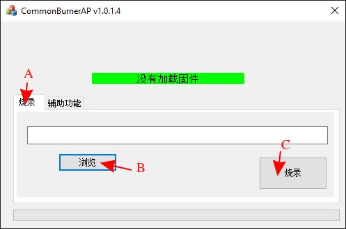
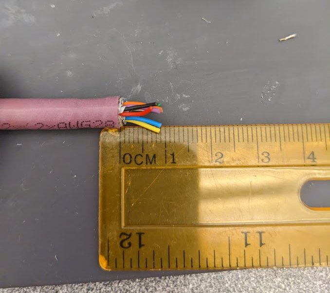
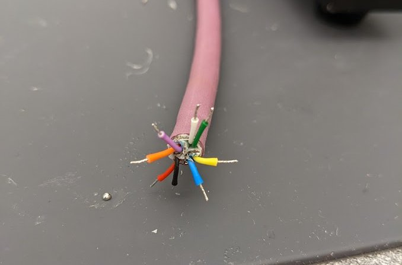
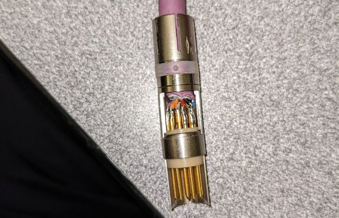
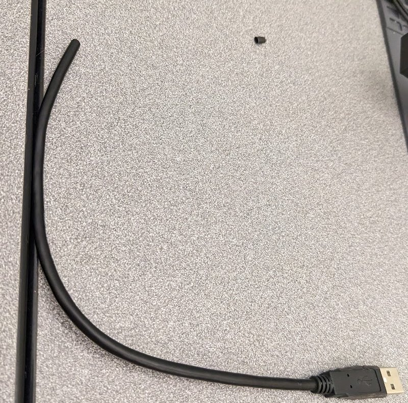
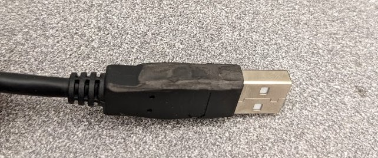
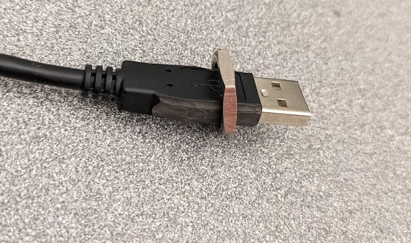
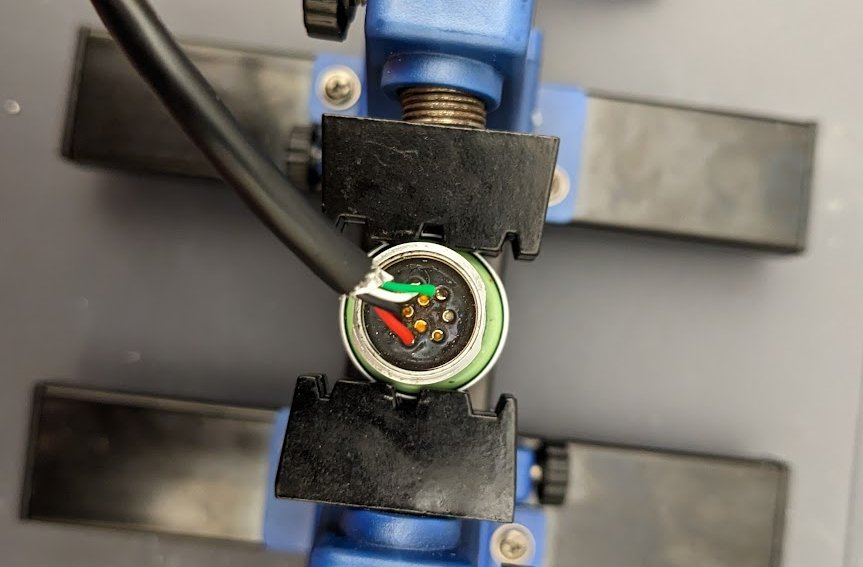
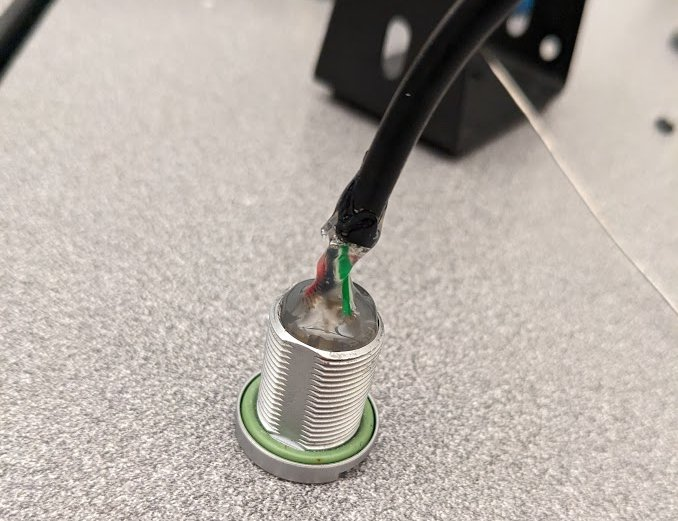

The current Cameras used on SeaWolf VIII are based on [ArduCam B0292](https://www.arducam.com/product/arducam-usb-autofocus-imx219-b0292/) cameras. These camera modules connect to a computer by USB and are UVC compliant, meaning they should easily work on most operating systems.

{: .center style="width:50%"}

*Note that a specific firmware must be flashed to these cameras for them to work properly with a Jetson Nano and for them to perform well in low light. See instructions below.*

The current camera enclosures are designed to be able to house two camera modules each. This is to allow stereo vision capabilities in the future. However, for now they are assembled using a single camera module.

{: .center style="width: 80%" }

## Camera Firmware

When wiring a new camera, or installing a new camera in the camera hull, it is necessary to make sure it is running the correct firmware. **This requires a windows PC**.

The camera firmware is flashed using a tool provided on the ArduCam forums. A zip with this flash tool and the firmware file to be flashed is located [here](https://drive.google.com/file/d/1UF6aPTeCx5p_h5UlSLCScOhPwagccd5p/view?usp=share_link).

This tool is windows only. Additionally, it seems to have issues (cuts off part of the UI) on HiDPI systems. You may need to set display scaling to 100% in windows settings before running the program.

After downloading the zip, extract it. There will be two things

- A folder named `CommonBurnerAP v1.0.1.4`
- A `.src` firmware file

In the `CommonBurnerAP` folder run `CommonBurnerAP.exe`. You must connect the camera you want to flash before launching `CommonBurnerAP.exe`.

Once launched, reference the image below and follow the steps below

- Make sure the tab labeled "A" is selected.
- Select the button labeled "B". This will bring up a file explorer window. Choose the `.src` firmware file
- Click the button labeled "C". This will start flashing. Wait for the flash to finish before disconnecting the camera.

{: .center style="width=80%" }

## Cable Assembly

The cable used for the cameras is an Igus CFBUS.PUR.068 cable. This cable is designed for USB 3.0 (8 pins with two shielded pairs), however we instead use it for 2x USB 2.0. This just means the shielding on the second set of wires is not strictly required.

USB 3.0 uses the following wire colors (paired)

- Red, Black (5V power)
- White, Green (Main data pair)
- Yellow, Blue (Supper Speed Direction 1)
- Orange, Purple (Super Speed Direction 2)

USB 2.0 uses the following

- Red, Black (5V power)
- White, Green (Main data pair)

Thus, for one camera, we can match wire colors. For the other camera, follow the table below.

| Igus Wire Color | Camera 1 Cable Color | Camera 2 Cable Color |
| --------------- | -------------------- | -------------------- |
| Red             | Red                  | ---                  |
| Black           | Black                | ---                  |
| White           | White                | ---                  |
| Green           | Green                | ---                  |
| Orange          | ---                  | Red                  |
| Purple          | ---                  | Black                |
| Yellow          | ---                  | White                |
| Blue            | ---                  | Green                |

This creates a cable looking something like the following where inside the enclosure there are two camera cables with ZHR-4 connectors for the camera modules. These go to a single cable running to the main hull, and inside the main hull they are split into two USB 2.0 type A connectors.

Note that the ZHR-4 connectors are from the wire that comes with the cameras. It is cut and spliced to the Igus cable.

{: .center style="width: 80%"}

{: .center style="width: 80%" }

Also note that the pinout for the fischer is located on the [Endcap Pinout](./endcap.md) page.

### Penetrator

Before anything else is done, install a penetrator (or wetlink penetrator) on the cable. Leave approx 5 inches of stripped wire after the penetrator.

{: .center style="width: 80%" }

Follow mechanical team procedures for penetrator installation (or have mech team follow said procedures).

### Camera Connector Splice

Cut the top 2-3 inches of a camera cable off and remove the outer insulation. This leaves a ZHR-4 with four wires (red, black, green, white). Splice these to the penetrated wire as shown in the table / diagram above.

*Note that the picture below was taken while assembling for one camera. For a second camera, repeat the process with a second camera cable and splice to the orange, purple, yellow, and blue wires.

{: .center style="width: 80%" }

### Fischer Plug

The fischer plug needs to be soldered onto the cable matching the pinout [here](./endcap.md). Follow general fischer soldering and assembly procedures [here](../connectors/fischers.md).

*Note that this fischer receptacle is more difficult to solder to than most. This is partially due to the three unused pins in the middle, partially due to the small wire gauge, and partially due to the length of wire you are able to strip back.*

*Even if you are only assembling for one camera, solder all wires to the fischer plug. Failure to do so will result in a much weaker connection to the wire.*

1. Strip 1cm (**no more**) of outer insulation off the Igus cable. Remove the paper shielding and mesh foil from all wires. Removing the paper and shielding is "difficult" (time consuming) and best done **carefully** using flush cuts. Make sure not to cut off any cables.

    {: .center style="width:80%" }

2. Strip about 2mm of each wire and tin it. **Do not strip more than 2mm. This wire insulation on the inner wires melts before solder, so it will shrink when you tin the wire.** After tinning, you should have approx 4mm of wire exposed. If less is exposed, strip off a little more insulation.

    {: .center style="width:80%" }

3. Then solder the wire to the fischer plug as you would normally solder a fischer. Follow the pinout. It is recommended to solder wires in the following order. You may have to cross wires across the connector and this order minimizes effort.

    - Of the following colors, solder whichever is "easier" first.
    - red or black
    - white or green
    - yellow or blue
    - purple or orange
    - Then repeat the same order but the other color.

    {: .center style="width:80%" }

4. Once soldered, as always, fully assemble the plug, connect it to a receptacle, and make sure there is not continuity between any used pins. Note that continuity between the three center pins is possible (due to contact with remnants of wire shielding), but is acceptable since they are unused.

### Fischer Receptacle

The fischer receptacle is much easier to assemble, primarily because the wire does not need to be so short.

1. Find a USB-A cable and cut off the other end (ie if it was a USB-A to USB-microB cable, cut off the micro-B side). It is best to find a cable with a similar USB-A connector to the one pictured. The outer material is rubber, which is important for step 2.

    {: .center style="width:80%" }

2. Using flush cuts, trim down the USB-A outer rubber to make it fit through the fisher recepticle's nut.

    {: .center style="width:80%" }

    {: .center style="width:80%" }

3. Strip and solder to the receptacle according to the endcap pinout. Note that only one wire is shown here. If two cameras are used, add a second USB-A cable to the recepticle on the apropriate pins. Follow the endcap pinout and table / diagram at the top of this section.

    {: .center style="width:80%" }

4. As always, add hot glue to the receptacle for strain relief.

    {: .center style="width:80%" }