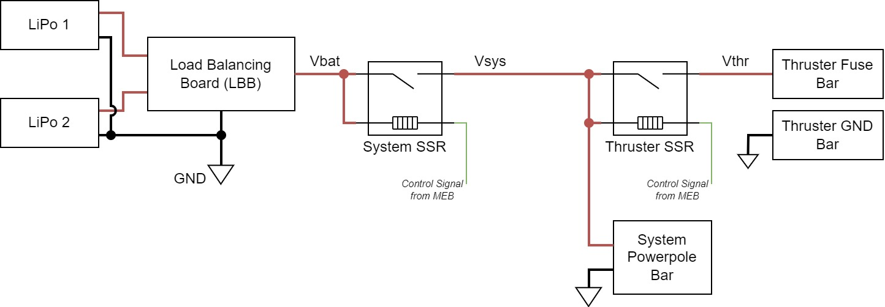

*Note that this page is currently an outline and most of the content is not yet written.*

SeaWolf VIII's (SW8) power system consists of several components layed out on and wired together on MOAB / FOAB. There is no central "power system" PCB / board on SW8. The components of the power system are described here. The boards involved have more detail on their pages under the "Boards" section.

## Power Input

### Battery Input

SeaWolf VIII is powered by two 4-cell (4S) LiPo batteries. Each battery is fused at 40A of current. These batteries are connected in parallel allowing for a total of 80A current draw from the batteries.

However, there are some cases where connecting LiPo batteries in parallel could cause issues

1. The LiPos are charged to different levels. In this case one would charge the other. This would not be a proper balance charge process. This could lead to fires.
2. One battery drains faster than the other (different age, wear / tear, different cells). While this is less likely, it could lead to one battery charging the other. This could again lead to fires.

To address these issues, SW8 has a "Load Balancing Board" used to connect the batteries in "parallel". The load balancing board conceptually chooses the higher voltage of the two batteries. The system is powered from that battery. When the batteries are charged equally, this effectively balances the load due to voltage drop of the battery under load. The output of the LBB is referred to as "Vbat" or "battery voltage" in the rest of the documentation.

*Note that if one battery is not charged or is performing poorly, this can lead to the other battery handing more load. In this case, the fused current limit is not the full 80A. However, in practice SW8 rarely pulls over 40A current (it is capable of running on a single battery if needed).*

Currently, there is no voltage or current monitor. However, there are plans to add individual voltage and current monitors for each battery (between LiPo and LBB). These monitors will likely be standalone modules initially, but can be integrated into LBB at a later date.

### Power Switching

TODO: System switch

TODO: MEB circuit

TODO: System power rail powers thruster SSR and all other regulators for computer, boards, etc

TODO: Thruster switching and killswitch (mention why no low-side switching)

## Power Distribution

TODO: Powerpole block bar

TODO: GND bar

TODO: Fuse bar

## Regulators

### Jetson Power Regulators

TODO: Old regulators & issues

TODO: Current regulators and architecture

### Other Regulators

TODO: Convention right now is for each board to have a UBEC. Longer term goal would be to have a Vbat -> 12V (custom SEPIC) and 12V to 5V (custom buck) regulators to make a common 5V and 12V rail. Each board would then be designed to take either 12V or 5V and have onboard LDOs for other required voltages

## USB Powered Devices

TODO: List of devices

TODO: Note USB current limitations and jetson limitations (plus increased sensitivity to voltage drops with old jetson regulator setup)

TODO: USB hub is externally powered. High current devices should go here. In the future a second hub (or a hub with more ports) may be needed to support 4 cameras (2 stereo cameras).

## MOAB / FOAB Layout

TODO: Image
