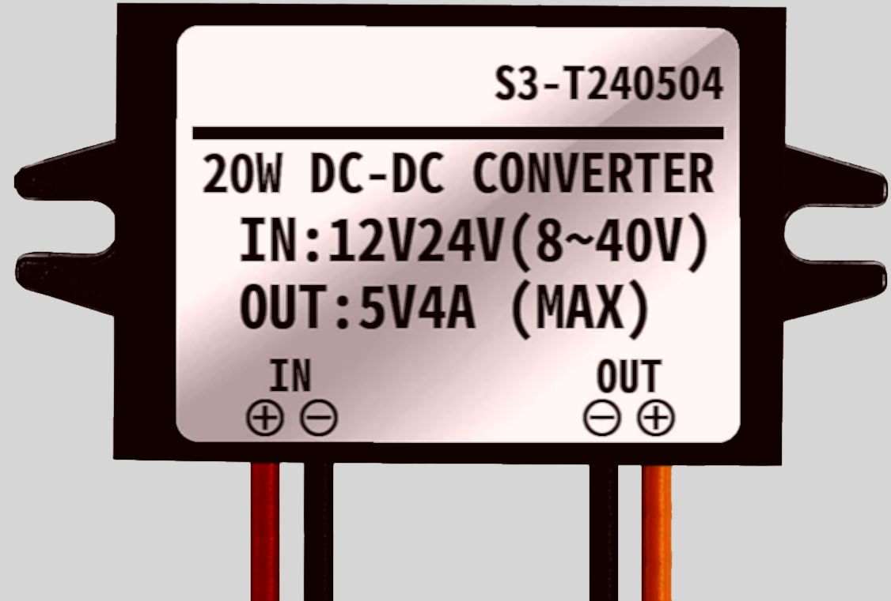
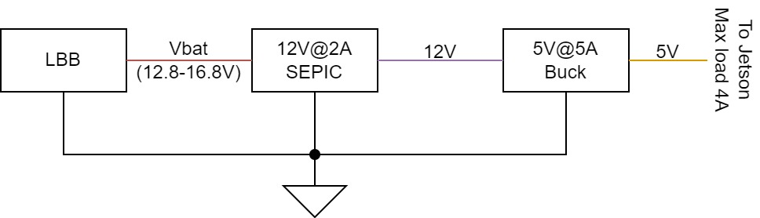

*Note that this page is currently an outline and most of the content is not yet written.*

SeaWolf VIII's (SW8) power system consists of several components layed out on and wired together on MOAB / FOAB. There is no central "power system" PCB / board on SW8. The components of the power system are described here. The boards involved have more detail on their pages under the "Boards" section.

## Power Input

### Battery Input

SeaWolf VIII is powered by two 4-cell (4S) LiPo batteries. Each battery is fused at 40A of current. These batteries are connected in parallel allowing for a total of 80A current draw from the batteries.

However, there are some cases where connecting LiPo batteries in parallel could cause issues

1. The LiPos are charged to different levels. In this case one would charge the other. This would not be a proper balance charge process. This could lead to fires.
2. One battery drains faster than the other (different age, wear / tear, different cells). While this is less likely, it could lead to one battery charging the other. This could again lead to fires.

To address these issues, SW8 has a "Load Balancing Board" used to connect the batteries in "parallel". The load balancing board conceptually chooses the higher voltage of the two batteries. The system is powered from that battery. When the batteries are charged equally, this effectively balances the load due to voltage drop of the battery under load. The output of the LBB is referred to as "Vbat" or "battery voltage" in the rest of the documentation.

*Note that if one battery is not charged or is performing poorly, this can lead to the other battery handing more load. In this case, the fused current limit is not the full 80A. However, in practice SW8 rarely pulls over 40A current (it is capable of running on a single battery if needed).*

Currently, there is no voltage or current monitor. However, there are plans to add individual voltage and current monitors for each battery (between LiPo and LBB). These monitors will likely be standalone modules initially, but can be integrated into LBB at a later date.

### Power Switching

There are two Solid State Relays (SSRs) used to switch power on SeaWolf VIII. The first one is the "System Power SSR". The output of this SSR is used to power the main system (everything except thrusters). This is unregulated voltage (battery voltage level).

The second SSR is the "Thruster Power SSR". This switches power on and off to the thrusters. This SSR is powered through the system SSR. Thus, if the system is off the thrusters are too. However the system can be switched on with the thrusters off. This allows the thrusters to be disconnected from power when the vehicle is in the "killed" state. Thrusters are powered when the vehicle is in the "armed" state.

The SSRs are controlled by the MEB. The system SSR is connected to the system power switch. This switch pulls the control line to GND to power the system on. Once the MEB boots, a GPIO holds this line LOW to keep the system on. To turn the system off, the system switch placed in the "off" position will pull this line high, thus turning off the SSR. See the [MEB](../boards/meb.md) page for more details.

Similarly, the MEB controls the Thruster SSR. The control signal for this, however, is not controlled by MEB software (it just runs through traces on the MEB). Normally, this control line is floating. However, the physical killswitch is connected between this line and GND. When the killswitch is closed, the line is pulled low and the thruster SSR is on. Thus the thrusters have power. When the killswitch is open, the line is floating and the thruster SSR is off.

Additionally, on newer versions of MEB (v1.2+) there is a software kill switch MOSFET. This mostfet is in series with the killswitch. The MOSFET is controlled by a GPIO signal directly from the Jetson. This acts as a "software kill". Both the software arm (GPIO high) and hardware arm (killswitch closed) must occur for the thrster SSR to be on. Again, see the [MEB](../boards/meb.md) page for more details.

## Power Distribution

As previously described, there are two main power domains: system power and thruster power.

System power is distributed using a Powerwerx PD-8 distribution block (powerpole connectors). Power from the system power SSR is run directly into this bar. Regulators for various system components.

TODO: Picture

Thruster power is distributed through two "bars". One is simply a ground bar. The system ground is connected directly to this bar and the GND connection of the ESCs are connected to the bar. This ground bar is used only for the thrusters. There is also a fuse bar used for thruster power. The fuse bar has one fuse for each of the 8 thrusters / ESCs (currently fused at 25A).

TODO: Picture

## Regulators

SeaWolf VIII uses a distributed power regulation architecture. This allowed for early development in a modular fashion early on. However, it should be noted that the distributed architecture is becoming quite messy. It is planned to eventually move away from such an architecture.

### Jetson Power Regulators

The Jetson Nano requires a 5V power supply capable of supplying 4A of current. Many such supplies exist fiarly cheap on amazon, such as [this](https://www.amazon.com/12V-24V-Converter-Transformer-Waterproof/dp/B09HTX6Q6D/) one, which we initially used. However, these supplies tend to have a high dropout voltage (eg min input is 8V for a 5V output).

{: style="width: 30%" }  
*Old Jetson Regulator*

However, it was observed that arming the thrusters resulted in a current draw spike. This dropped battery voltage to about 7.6V for 100 microseconds. However, this was long enough to drop the regulator output to 3.8V and brown out the Jetson.

Our initial solution to this problem was to switch to a better regulator with a lower dropout, specifically [Pololu D24V50F5](https://www.pololu.com/product/2851). However, we were still able to brown out the Jetson because buck regulators tend to be sensative to input voltage drops. To address this, a dual stage regulator architecture was selected:

- First, battery voltage is regulated to 12V using a 2A SEPIC topology regulator
- Second, the 12V is regulated to 5V using a 4A+ Buck topology regulator

The SEPIC topology is more tolerant of rapid input voltage changes, however a high current (4A) SEPIC is more difficult to find than a lower current one. Thus, 12V@2A is easier than 5V@4A (note: this is true when buying a regulator and likely also when designing one). However, since the jetson requires 5V, a 5V buck regulator is also required to supply the system with enough power. The regulators used for this are

- 12V@2A SEPIC: [Pololu S18V20F12](https://www.pololu.com/product/2577)
- 5V@4A Buck: [Pololu D24V50F5](https://www.pololu.com/product/2851)

??? custom "Part Selection justification"
    Justification for the compound regulator design based on graphs on product pages:
    
    - Worst “steady state” case: Vbat = 12.8V, Icomputer = 4A
        - Pcomputer = 5V * 4A 0= 20W
        - P12V = Pcomputer / efficiency = 20W / 0.92 = 22W
        - I_12V = P12V / 12V = 1.8A (less than expected 2.5A max output at this battery input)
    - Worst “possible” case: If Pcomputer = 20W and 12V regulator is only 80% efficient
        - P12V = 20W / 0.8 = 25W
        - I_12V = 25W / 12V = 2.08A
    
    Expected output current of 12V regulator for vbat = 8V up to 24V is at least 2.25A, thus this handles both worst cases properly given our system requirements, even during the 100 microsecond battery voltage drop to ~8V.

With the dual regulator architecture described above, no meaningful voltage drops (over 0.05V) were observed on the Jetson's 5V line when arming thrusters (though battery voltage dropping to 7.6 was still observed). 

??? custom "Notes on Voltage Drop when Arming"
    It was also concluded that inrush current when powering the ESCs is an expected quantity. Thus, the voltage drop is not indicative of a flaw in the system. However this could indicate of poorer battery performance than advertised.
    
    At the time of testing we were using the "old" Turnigy Graphene 4S 10000mAH LiPo batteries. While advertised as being 15C batteries, it is suspected that they may not be or that they may not handle current spikes well. It is possible this would be less of an issue with better batteries (untested as of now).

    Regardless, the change in regulator architecture results in a more robust system capable of being run off a wider range of power source. Thus, it is still a worthwhile change to keep even if unnecessary in the future with potentially better batteries.

### Other Regulators

Other systems are less sensitive to short term voltage drops (and pull lower amounts of current than the jetson, resulting in lower drops on regulator outputs). Thus, a single buck regulator is sufficient in other cases.

Currently, the only other regulated power required in the system is 5V. This is required by the following components (excluding USB powered devices)

- MSB
- Acoustics system (distribution board)
- USB Hub

All of these devices use off-the-shelf "UBEC" modules from Adafruit: [Adafruit UBEC](https://www.adafruit.com/product/1385) capable of supplying 3A of current. **Note: we have tested similar looking cheaper UBECs from Amazon. These are done incorrectly and fail quickly or cannot supply sufficient current.**

## USB Powered Devices

USB power is generally only used to power devices that the Jetson directly communicates with. It is unnecessary to connect USB data without power for most such devices. Thus, the following devices are powered over USB.

- MEB&ast;
- Acoustics FPGA
- All cameras (either 2 or 4; depends on whether mono or stereo vision configuration)
- Control Board

Note that some of these devices are powered off the USB hub's UBEC. Typical USB ports on a computer (including the Jetson) are only capable of supplying 480mA to 600mA per port. Thus, when adding a 4-port hub, this cuts the power down to 25% per port on the hub. To address this, the hub is independently powered allowing more current per port on the hub. This dedicated regulator also allows the hub to supply slightly more power per device than the jetson can. Thus, high current devices (if any) should be connected to the hub, not directly to the jetson.

&ast; MEB should currently always be powered off the USB hub. The jetson's USB ports take about 30 second to power on after the jetson gets power. Thus, if connected to the jetson, it takes about 30 second for MEB to get power and boot. MEB cannot hold the system powered on until it boots, thus when MEB is connected to the jetson, the system switch must be connected and left in the ON position for about 30 seconds before removing it. In contrast, the UBEC starts and powers the USB hub (and anything connected to the hub) as soon as the system is powered on. Thus, the system switch only needs to be left in place for a few seconds at most.

## MOAB / FOAB Layout

TODO: Image
