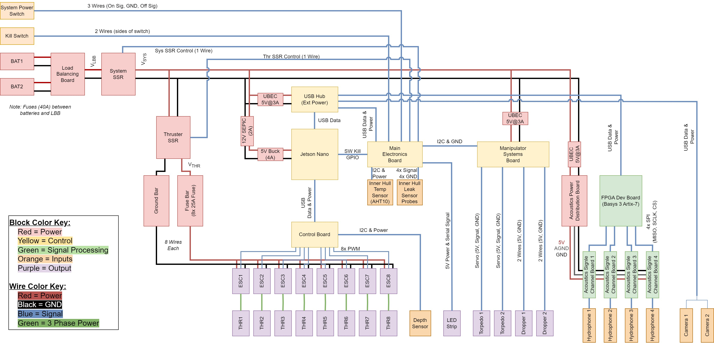

## MOAB / FOAB

The **M**other **O**f **A**ll **B**oards (MOAB) and **F**ather **O**f **A**ll **B**oards (FOAB) are the two copies of the electrical system use in SeaWolf VIII. MOAB and FOAB refer to the whole assembly on which the electronic system is assembled. It also serves to mean "the whole electrical system" for the purposes of most documentation.

There are two such boards, however the two are rarely identical. The idea is that one is a stable platform (and in active use by software at pool tests) while the other is the electrical team's working platform. Once electrical team finishes making and testing changes, the working and stable platforms swap.

For example, if MOAB is stable and used in the robot, a new board could be added to FOAB. Once added and verified, FOAB and MOAB would be swapped making FOAB the stable system. MOAB would then be updated to match FOAB's changes and the next set of changes would occur on MOAB.

TODO: Picture

## System Block Diagram

{: }

*Last Update: 05/24/2023 by Marcus Behel*

??? custom "History"
    **05/24/2023: Add cameras (Marcus Behel)**  
    **03/16/2023: Initial Drawing (Marcus Behel)**

## System Description

SeaWolf VIII (SW8) is designed to use a Jetson Nano as its main computer. This computer runs mission code along with vision and machine learning algorithms.

The following devices are connected to the computer via USB

- Main Electronics Board (MEB): The MEB handles system power and acts as a communication bridge between the Jetson and the electrical system. The Jetson communicates with the MEB via UART (over USB). The MEB connects to sensors and other parts of the electrical system via I2C. When the computer needs to use other parts of the electrical system (eg the Manipulator Systems Board or MSB to control droppers) the computer will send a message to the MEB. The MEB will then send the correct command to the MSB via I2C. For more details on the MEB itself see the [MEB](../boards/meb.md) page.
- Acoustics FPGA: Currently, the computer communicates with the acoustics system via UART using the USB/UART converter builtin to the FPGA development board. Eventually, the goal is to re-design this so that the acoustics system is connected to MEB via I2C and the computer communicates with it via the MEB. For details on the acoustics system design see the [Acoustics System](./acoustics.md) page.
- Control Board: This is a motion coprocessor. The computer instructs the control board to perform a motion using a high-level description of that motion. The control board handles achieving that motion using the vehicle's thrusters. The computer talks to the control board via UART (over USB). See the [Control Board](../boards/controlboard.md) page for more details.
- Cameras: Each camera is either a mono or stereo camera. These cameras are used for vision by mission code. See the [Cameras](./cameras.md) page for details on the camera assemblies.

In addition to the devices mentioned above, the following are important parts of the electrical system design

- Power: The MOAB / FOAB contains the power system for SeaWolf VIII. SeaWolf VIII runs off two 4-cell LiPo batteries. These batteries power the thrusters through a kill mechanism (although no voltage regulation occurs). Other systems run off regulated battery power (typically either 3.3V or 5V). See the [Power System](./moab_power.md) page for details.
- Thrusters & ESCs: SeaWolf VIII uses BlueRobotic's T200 thrusters along with their "Basic ESC"s. These are connected to and managed by the control board.
